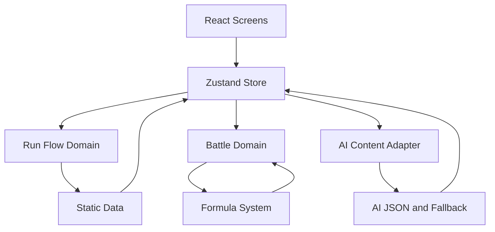

# ARCHITECTURE

## 1. 文档定位

本文档是项目 [`无限世界`](纯前端AI人物驱动回合制游戏_MVP设计稿.md) 的长期架构规范。
后续所有设计、实现、重构、调试与扩展工作，都应先阅读 [`ARCHITECTURE.md`](ARCHITECTURE.md)，再进入具体执行。

本文档用于统一以下内容：

- 技术栈选型
- 工程分层
- 核心模块边界
- 单文件发布策略
- AI 接入边界
- 数值与战斗实现约束
- 后续新增功能时的决策原则

---

## 2. 项目目标摘要

根据 [`纯前端AI人物驱动回合制游戏_MVP设计稿.md`](纯前端AI人物驱动回合制游戏_MVP设计稿.md) 与 [`数值公式v1.1.md`](数值验算/数值公式v1.1.md)，本项目属于：

- 纯前端网页游戏
- AI 人物与事件增强内容驱动
- 小队回合制战斗
- 单局 roguelite 节点推进
- 开发期多文件模块化
- 发布期输出单一 [`index.html`](index.html)

该定位决定了工程方案必须同时满足：

1. 规则实现稳定可验证
2. UI 界面状态可维护
3. AI 内容与规则层彻底解耦
4. 开发时可拆分，发布时可收敛为单文件

---

## 3. 技术栈总原则

### 3.1 推荐技术栈

项目默认采用以下技术栈：

- 语言：[`TypeScript`](ARCHITECTURE.md)
- UI 框架：[`React`](ARCHITECTURE.md)
- 构建工具：[`Vite`](ARCHITECTURE.md)
- 状态管理：[`Zustand`](ARCHITECTURE.md)
- 样式方案：[`Tailwind CSS`](ARCHITECTURE.md) 或 CSS Modules
- 测试重点：战斗公式与状态流转的纯函数测试
- 发布形态：单一 [`index.html`](index.html)

### 3.2 默认结论

除非后续出现明确且必要的反证，否则本项目应固定采用：

**[`TypeScript`](ARCHITECTURE.md) + [`React`](ARCHITECTURE.md) + [`Vite`](ARCHITECTURE.md) + [`Zustand`](ARCHITECTURE.md)**

这是当前项目的默认长期架构，不再反复讨论基础框架选型。

---

## 4. 为什么使用这套方案

### 4.1 选择 [`TypeScript`](ARCHITECTURE.md) 的原因

本项目存在大量结构化数据与规则对象，例如：

- 角色数据
- 技能模板
- Buff 与 Debuff
- 战斗状态
- 节点地图
- 事件结果
- AI 结构化输出
- 结局摘要

在 [`纯前端AI人物驱动回合制游戏_MVP设计稿.md`](纯前端AI人物驱动回合制游戏_MVP设计稿.md:487) 中已经采用 [`export type Character = {}`](纯前端AI人物驱动回合制游戏_MVP设计稿.md:491) 的方式描述核心数据结构，这意味着：

- 类型系统应成为项目基础设施
- 接口约束必须前置
- 规则数据应可静态检查
- 状态流转应尽量减少隐式字段错误

因此，禁止将核心逻辑长期建立在无类型的原生 [`JavaScript`](ARCHITECTURE.md) 之上。

### 4.2 选择 [`React`](ARCHITECTURE.md) 的原因

本项目是 UI 面板密集型游戏，而不是 Canvas 主导型动作游戏。

MVP 明确存在多个主要界面：

- 标题页
- 开局页
- 地图节点页
- 事件页
- 招募页
- 战斗页
- 营地或商店页
- 结算页

这些界面天然适合拆分为独立组件与屏幕模块，使用 [`React`](ARCHITECTURE.md) 可以获得：

- 组件化渲染能力
- 条件渲染能力
- 状态驱动 UI 更新能力
- 面板与卡牌结构的高复用性
- 后续动画与响应式适配的可扩展性

### 4.3 选择 [`Vite`](ARCHITECTURE.md) 的原因

本项目要求：

- 开发期多文件结构清晰
- 最终产物压缩为单文件分发

[`Vite`](ARCHITECTURE.md) 在以下方面最符合目标：

- 本地开发体验快
- 对 [`TypeScript`](ARCHITECTURE.md) 与 [`React`](ARCHITECTURE.md) 支持成熟
- 易接入单文件打包策略
- 产物结构简单，适合后续生成单一 [`index.html`](index.html)

### 4.4 选择 [`Zustand`](ARCHITECTURE.md) 的原因

本项目属于全局状态明显且跨界面共享严重的游戏应用。需要集中管理的状态包括：

- 当前局种子
- 当前章节与节点
- 地图路径
- 队伍成员
- 角色关系倾向
- 资源与商店状态
- 战斗流程临时态
- 日志与事件结果
- 结局内容缓存
- AI 生成内容缓存

相比更重的方案，[`Zustand`](ARCHITECTURE.md) 更适合本项目 MVP：

- 轻量
- 模板代码少
- 更贴合游戏状态容器场景
- 容易拆分为多个 slice

---

## 5. 明确不采用的主方向

### 5.1 不直接以巨型单 [`index.html`](index.html) 开发

禁止在项目起步阶段直接把所有逻辑、样式、数据、UI 都堆进一个巨大单文件。

原因：

- 不利于维护
- 不利于模块化测试
- 不利于规则与表现分离
- 不利于多人或长期协作
- 后续战斗、事件、地图逻辑会迅速失控

正确方式是：

- 开发时多文件模块化
- 构建时单文件输出

### 5.2 不以原生 DOM 手写作为主框架

不建议长期基于手工 [`document.querySelector()`](ARCHITECTURE.md) 和字符串模板维护页面。

这种方式只适合极小 demo，不适合当前这种多界面、多状态、多规则系统并存的游戏。

### 5.3 不以 [`Phaser`](ARCHITECTURE.md) 作为主框架

本项目不是以实时地图、物理、精灵碰撞为核心的 Canvas 游戏。
主体验来自：

- 卡牌式 UI
- 状态面板
- 回合菜单
- 文本事件
- 角色互动反馈

因此不以 [`Phaser`](ARCHITECTURE.md) 作为主框架。

---

## 6. 工程总体结构

建议项目采用如下目录结构：

```text
src/
  app/
    store/
    providers/
    bootstrap/
  domain/
    battle/
    formulas/
    run/
    ai/
    character/
    event/
    reward/
  data/
    archetypes/
    skills/
    enemies/
    events/
    constants/
  screens/
    title/
    start/
    map/
    event/
    recruit/
    battle/
    camp/
    result/
  components/
    common/
    battle/
    map/
    event/
    character/
  hooks/
  utils/
  styles/
  assets/
```

如果后续规模较小，也可简化，但必须保留以下分层思想：

- [`app`](ARCHITECTURE.md) 负责应用装配
- [`domain`](ARCHITECTURE.md) 负责规则逻辑
- [`data`](ARCHITECTURE.md) 负责静态配置
- [`screens`](ARCHITECTURE.md) 负责页面级 UI
- [`components`](ARCHITECTURE.md) 负责可复用视图部件

---

## 7. 模块职责边界

### 7.1 [`domain`](ARCHITECTURE.md) 层

[`domain`](ARCHITECTURE.md) 层是项目核心，负责所有可验证规则，不允许混入页面渲染细节。

应包含：

- 战斗结算
- 属性导出
- 命中与伤害公式
- 治疗与护盾结算
- 状态效果更新
- 节点推进规则
- 招募与奖励规则
- AI 输出修正与 fallback 规则

禁止在 [`domain`](ARCHITECTURE.md) 层直接依赖浏览器 DOM。

### 7.2 [`data`](ARCHITECTURE.md) 层

[`data`](ARCHITECTURE.md) 层负责静态配置与模板池，例如：

- 角色原型池
- 技能模板
- 敌人模板
- 事件模板
- 掉落或奖励配置
- 关键常量表

[`data`](ARCHITECTURE.md) 不负责计算流程，只提供可消费的数据。

### 7.3 [`screens`](ARCHITECTURE.md) 层

[`screens`](ARCHITECTURE.md) 负责页面级布局与交互编排，例如：

- 显示当前页面
- 绑定按钮行为
- 调用 store action
- 展示战斗日志
- 展示事件描述与选项

[`screens`](ARCHITECTURE.md) 不应承载复杂公式与战斗结算核心逻辑。

### 7.4 [`components`](ARCHITECTURE.md) 层

[`components`](ARCHITECTURE.md) 负责通用 UI 组件，例如：

- 角色卡片
- 状态条
- 技能按钮组
- 选择列表
- 节点图元
- 日志面板

组件应尽量无业务副作用，优先由 props 驱动。

---

## 8. 状态管理约束

建议将全局状态拆分为以下几类：

### 8.1 单局流程状态

例如：

- 当前章节
- 当前节点
- 地图路线
- 已发生事件
- 当前货币与奖励
- 结局条件

### 8.2 战斗临时状态

例如：

- 行动顺序
- 当前行动者
- 敌我单位状态
- Buff 与 Debuff
- 护盾层
- 战斗日志
- 战斗胜负结果

### 8.3 UI 状态

例如：

- 当前打开的面板
- 选中目标
- 对话框显隐
- 动画播放阶段
- 日志展开状态

### 8.4 内容缓存状态

例如：

- AI 生成人物档案
- AI 生成事件文本
- fallback 内容结果
- 本局编年史缓存

状态管理要求：

1. 关键状态必须可序列化
2. 战斗状态与页面状态尽量分离
3. Action 命名必须语义明确
4. UI 临时态不可污染核心规则状态

---

## 9. 战斗系统实现原则

根据 [`数值公式v1.1.md`](数值验算/数值公式v1.1.md) 与 [`battle_test_platform.html`](数值验算/battle_test_platform.html)，战斗规则应严格按照“纯函数优先”的思路落地。

### 9.1 公式与 UI 分离

必须遵守：

- 先计算结果
- 再生成日志
- 最后驱动表现

推荐结构：

- [`deriveStats()`](src/domain/formulas.ts:1)
- [`calcHitChance()`](src/domain/formulas.ts:1)
- [`calcDamage()`](src/domain/formulas.ts:1)
- [`calcHeal()`](src/domain/formulas.ts:1)
- [`calcShield()`](src/domain/formulas.ts:1)
- [`applyStatusEffects()`](src/domain/battle.ts:1)
- [`runTurnAction()`](src/domain/battle.ts:1)
- [`advanceBattleState()`](src/domain/battle.ts:1)

### 9.2 战斗层的强约束

- 不允许把伤害公式写进 [`React`](ARCHITECTURE.md) 组件内部
- 不允许把 Buff 结算和按钮点击逻辑耦合在一起
- 不允许把日志文本作为真实规则来源
- 不允许让 AI 直接决定伤害数值、命中结果、异常公式

### 9.3 数值规则来源

如果后续实现与文档冲突，优先对照以下来源：

1. [`数值公式v1.1.md`](数值验算/数值公式v1.1.md)
2. [`battle_test_platform.html`](数值验算/battle_test_platform.html)
3. 项目后续新增的自动化测试用例

---

## 10. AI 内容接入原则

### 10.1 AI 只负责内容层

AI 可以负责：

- 名字
- 称号
- 背景故事
- 性格标签组合
- 台词风格
- 事件文本描述
- 结局编年史

AI 不可以负责：

- 伤害公式
- 技能机制创造
- 数值平衡
- 敌人底层行为规则
- 掉落概率
- Buff 与 Debuff 规则

### 10.2 AI 输出必须结构化

所有 AI 输出必须优先约束成结构化对象，再进入渲染层。

建议统一经过类似以下模块：

- [`generateRunIntro()`](src/domain/ai.ts:1)
- [`generateRecruitProfile()`](src/domain/ai.ts:1)
- [`generateEventText()`](src/domain/ai.ts:1)
- [`generateEndingChronicle()`](src/domain/ai.ts:1)
- [`sanitizeAIResult()`](src/domain/ai.ts:1)
- [`fallbackRecruitProfile()`](src/domain/generators.ts:1)
- [`fallbackEvent()`](src/domain/generators.ts:1)

### 10.3 AI 失败必须不中断流程

MVP 硬性要求：

- AI 请求失败时必须启用本地模板
- 游戏流程不得因 AI 不可用而中断
- Fallback 不是补丁，而是架构必需项

---

## 11. 页面组织原则

页面建议按以下顺序组织：

1. 标题页
2. 开局页
3. 地图页
4. 事件页
5. 招募页
6. 战斗页
7. 营地或商店页
8. 结算页

建议拆分为类似结构：

- [`src/screens/title/TitleScreen.tsx`](src/screens/title/TitleScreen.tsx)
- [`src/screens/start/RunStartScreen.tsx`](src/screens/start/RunStartScreen.tsx)
- [`src/screens/map/MapScreen.tsx`](src/screens/map/MapScreen.tsx)
- [`src/screens/event/EventScreen.tsx`](src/screens/event/EventScreen.tsx)
- [`src/screens/recruit/RecruitScreen.tsx`](src/screens/recruit/RecruitScreen.tsx)
- [`src/screens/battle/BattleScreen.tsx`](src/screens/battle/BattleScreen.tsx)
- [`src/screens/camp/CampScreen.tsx`](src/screens/camp/CampScreen.tsx)
- [`src/screens/result/ResultScreen.tsx`](src/screens/result/ResultScreen.tsx)

这些名称属于推荐规范，后续可微调，但不得破坏页面分层思路。

---

## 12. 单文件发布策略

### 12.1 开发与发布分离

开发期必须保持多文件工程结构。

发布期目标为：

```text
dist/
  index.html
```

即最终对外发布时，将脚本与样式收敛为单一 [`index.html`](index.html)。

### 12.2 单文件产物要求

最终单文件发布产物应满足：

- 仅一个 [`index.html`](index.html)
- 样式内联
- 脚本内联
- 本地静态打开可运行核心流程
- 不依赖外部 js 与 css 文件

### 12.3 禁止反向推导开发结构

“最终需要单 [`html`](index.html)” 不意味着开发期也必须单文件。

这是本项目必须长期遵守的工程纪律：

- 开发结构服务于可维护性
- 发布结构服务于分发便利性
- 两者不可混为一谈

---

## 13. 推荐开发顺序

后续真正进入编码时，应按以下顺序推进：

1. 定义核心类型
2. 落地公式模块
3. 落地战斗状态机
4. 落地静态数据模板
5. 落地单局流程状态
6. 落地页面骨架
7. 接入 AI 与 fallback
8. 最后处理单文件打包输出

这意味着：

- 先规则
- 后界面
- 先可玩闭环
- 后表现优化

---

## 14. 新功能接入时的判定规则

以后新增任何功能时，都必须先判断它属于哪一层：

| 功能类型 | 应放位置 |
| --- | --- |
| 数值公式 | [`domain/formulas`](ARCHITECTURE.md) |
| 战斗流程 | [`domain/battle`](ARCHITECTURE.md) |
| 节点推进 | [`domain/run`](ARCHITECTURE.md) |
| AI 生成与修正 | [`domain/ai`](ARCHITECTURE.md) |
| 静态模板库 | [`data`](ARCHITECTURE.md) |
| 页面结构 | [`screens`](ARCHITECTURE.md) |
| 通用卡片与面板 | [`components`](ARCHITECTURE.md) |
| 全局共享状态 | [`app/store`](ARCHITECTURE.md) |

若一个改动无法明确归层，优先停下来重构边界，而不是直接堆进去。

---

## 15. 后续协作默认规则

从现在起，后续关于本项目的方案讨论、编码、调试、重构与扩展，应默认遵守以下流程：

1. 先阅读 [`ARCHITECTURE.md`](ARCHITECTURE.md)
2. 再阅读当前任务直接相关文档
3. 明确本次改动属于哪一层
4. 再制定执行计划
5. 最后实施

如果后续出现与 [`ARCHITECTURE.md`](ARCHITECTURE.md) 冲突的新需求，应优先更新 [`ARCHITECTURE.md`](ARCHITECTURE.md)，再开始实现，不允许长期口头偏离。

---

## 16. 架构摘要图



---

## 17. 补充架构要求

### 17.1 这套框架是否足够支撑到开发完成

结论：**足够**，但需要补齐若干工程基础设施约束。

当前主技术栈 [`TypeScript`](ARCHITECTURE.md) + [`React`](ARCHITECTURE.md) + [`Vite`](ARCHITECTURE.md) + [`Zustand`](ARCHITECTURE.md) 可以覆盖以下完整链路：

- 规则实现
- UI 页面开发
- 状态管理
- 本地调试
- 模块化拆分
- 数据模板维护
- AI 内容适配
- 最终单文件构建输出

但如果要稳定推进到“可交付版本”，不能只停留在框架层，还必须同时具备：

1. 明确的目录骨架
2. 稳定的类型与配置入口
3. 规则层与表现层隔离
4. 测试目录与验算入口
5. 构建输出目录约束
6. AI 配置与 fallback 模板目录
7. 静态资源归档方式

因此，本项目的长期结论不是单纯“框架够不够”，而是：

- 框架本身够用
- 但必须配套完整目录结构与工程约束
- 只要遵守本文档中的分层与目录规范，这套方案可以支撑到 MVP 完成，且具备继续扩展的空间

### 17.2 建议补充的工程能力

在正式编码阶段，建议默认补充以下工程能力：

- [`ESLint`](ARCHITECTURE.md) 进行代码规范检查
- [`Prettier`](ARCHITECTURE.md) 统一格式
- [`Vitest`](ARCHITECTURE.md) 用于纯函数与规则测试
- 单文件打包插件或构建脚本，用于生成最终单 [`index.html`](index.html)

其中：

- [`ESLint`](ARCHITECTURE.md) 与 [`Prettier`](ARCHITECTURE.md) 属于工程质量底座
- [`Vitest`](ARCHITECTURE.md) 对战斗公式、状态流转、事件结果校验非常关键
- 单文件输出工具用于满足最终发布目标

这些属于建议默认配置，而不是推翻当前主架构。

---

## 18. 完整目录规范

为支持项目从当前规划阶段推进到可开发、可维护、可打包、可测试状态，目录建议固定如下：

```text
plans/
  README.md

public/

src/
  app/
    bootstrap/
    providers/
    router/
    store/
  assets/
    audio/
    icons/
    images/
  components/
    battle/
    character/
    common/
    event/
    layout/
    map/
  data/
    archetypes/
    constants/
    enemies/
    events/
    items/
    skills/
    templates/
  domain/
    ai/
    battle/
    character/
    formulas/
    run/
    reward/
    save/
  hooks/
  screens/
    battle/
    camp/
    event/
    map/
    recruit/
    result/
    start/
    title/
  styles/
    globals/
    themes/
  tests/
    battle/
    formulas/
    run/
  types/
  utils/
  main.tsx
  App.tsx

scripts/

dist/
```

### 18.1 根目录说明

- [`plans`](plans) 用于保存执行计划、阶段说明与后续路线图
- [`public`](public) 用于少量无需编译转换的公开资源
- [`src`](src) 是全部开发主目录
- [`scripts`](scripts) 用于构建辅助脚本，例如单文件输出整理
- [`dist`](dist) 是构建产物目录，不手工维护业务代码

### 18.2 [`src`](src) 内部分层说明

#### [`src/app`](src/app)

负责应用装配层：

- provider 注册
- store 组装
- 应用入口路由或页面切换器
- 启动初始化流程

#### [`src/domain`](src/domain)

负责核心规则层：

- 数值公式
- 战斗状态机
- 事件结算
- 单局流程推进
- AI 结果修正
- 存档结构定义与序列化

#### [`src/data`](src/data)

负责静态模板与表配置：

- 角色原型池
- 技能模板库
- 敌人模板库
- 事件模板库
- 道具模板库
- fallback 文本模板
- 常量与枚举性配置

#### [`src/screens`](src/screens)

负责页面级 UI：

- 每个主页面一个独立目录
- 页面内部可以再细分局部组件

#### [`src/components`](src/components)

负责高复用界面部件：

- 条形状态组件
- 卡牌组件
- 面板组件
- 对话框组件
- 日志组件
- 通用按钮与布局组件

#### [`src/tests`](src/tests)

负责前端内建规则测试：

- 公式验算
- 战斗流程测试
- 节点推进测试

#### [`src/types`](src/types)

负责通用类型导出，不放业务逻辑。

#### [`src/utils`](src/utils)

负责通用纯工具，例如：

- 随机种子工具
- 深拷贝工具
- 格式化工具
- 安全解析工具

### 18.3 页面目录建议

页面层建议固定为：

- [`src/screens/title`](src/screens/title)
- [`src/screens/start`](src/screens/start)
- [`src/screens/map`](src/screens/map)
- [`src/screens/event`](src/screens/event)
- [`src/screens/recruit`](src/screens/recruit)
- [`src/screens/battle`](src/screens/battle)
- [`src/screens/camp`](src/screens/camp)
- [`src/screens/result`](src/screens/result)

### 18.4 规则目录建议

规则层建议固定为：

- [`src/domain/formulas`](src/domain/formulas)
- [`src/domain/battle`](src/domain/battle)
- [`src/domain/run`](src/domain/run)
- [`src/domain/character`](src/domain/character)
- [`src/domain/reward`](src/domain/reward)
- [`src/domain/ai`](src/domain/ai)
- [`src/domain/save`](src/domain/save)

其中新增 [`src/domain/save`](src/domain/save)，是因为纯前端游戏通常会较早涉及本地存档、局内恢复、版本兼容问题，建议从目录层提前预留。

### 18.5 数据目录建议

数据层建议固定为：

- [`src/data/archetypes`](src/data/archetypes)
- [`src/data/skills`](src/data/skills)
- [`src/data/enemies`](src/data/enemies)
- [`src/data/events`](src/data/events)
- [`src/data/items`](src/data/items)
- [`src/data/constants`](src/data/constants)
- [`src/data/templates`](src/data/templates)

其中：

- [`src/data/items`](src/data/items) 预留给回复、强化、战斗消耗品与商店货物
- [`src/data/templates`](src/data/templates) 专门用于 AI fallback 内容模板

---

## 19. 当前阶段目录整理原则

目前阶段的目录整理目标不是一次性创建所有业务文件，而是先把长期稳定的骨架搭起来。

因此当前应当：

1. 先创建主要目录
2. 必要时放入占位文件保证目录语义清晰
3. 暂不生成大量空业务实现文件
4. 等进入编码阶段再逐步补齐实际模块

这是为了避免：

- 空文件过多
- 命名过早固化
- 维护成本上升
- 目录存在但职责不明确

---

## 20. 最终架构结论

本项目固定采用以下主架构：

- 使用 [`TypeScript`](ARCHITECTURE.md) 作为基础语言
- 使用 [`React`](ARCHITECTURE.md) 作为 UI 框架
- 使用 [`Vite`](ARCHITECTURE.md) 作为构建工具
- 使用 [`Zustand`](ARCHITECTURE.md) 管理全局状态
- 建议补充 [`ESLint`](ARCHITECTURE.md)、[`Prettier`](ARCHITECTURE.md)、[`Vitest`](ARCHITECTURE.md) 作为工程基础设施
- 使用多文件模块化开发
- 在发布阶段输出单一 [`index.html`](index.html)
- 将 AI 严格限制在内容生成层
- 将数值与战斗严格约束在可验证的规则层
- 使用本文定义的完整目录骨架推进后续开发

该结论作为当前项目默认长期执行方案。
