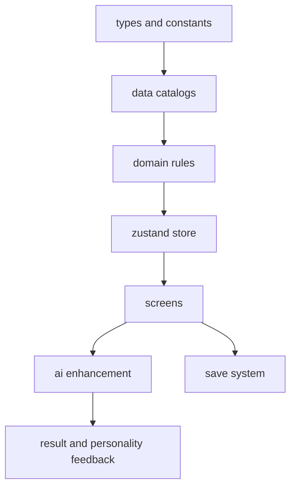

# MVP videcoding 实施计划

## 1. 文档目的

本文档基于 [`纯前端AI人物驱动回合制游戏_MVP设计稿.md`](../纯前端AI人物驱动回合制游戏_MVP设计稿.md) 与 [`ARCHITECTURE.md`](../ARCHITECTURE.md) 整理，目标是把当前 MVP 方案拆成一套适合逐步 videcoding 构筑的执行蓝图。

本计划默认前提：

- 仅基于当前目录骨架推进
- 按从零开始实现 MVP 规划
- 不依赖现有数值验算平台作为正式代码基线
- 开发顺序遵循先规则闭环、后 AI 增强

---

## 2. 核心实施结论

这个项目不应一开始就做 AI，也不应先铺满所有页面。

正确顺序应为：

1. 先完成 [`src/domain`](../src/domain) 内的可验证规则骨架
2. 再完成 [`src/app/store`](../src/app/store) 的单局状态装配
3. 再构建最小可玩页面闭环
4. 最后接入 AI 生成与 fallback
5. 再补人物驱动反馈与结算表现

对应设计稿中的分期：

- Phase 1 无 AI 骨架，见 [`纯前端AI人物驱动回合制游戏_MVP设计稿.md:671`](../纯前端AI人物驱动回合制游戏_MVP设计稿.md:671)
- Phase 2 AI 接入，见 [`纯前端AI人物驱动回合制游戏_MVP设计稿.md:679`](../纯前端AI人物驱动回合制游戏_MVP设计稿.md:679)
- Phase 3 人物驱动增强，见 [`纯前端AI人物驱动回合制游戏_MVP设计稿.md:687`](../纯前端AI人物驱动回合制游戏_MVP设计稿.md:687)

---

## 3. 实现原则

### 3.1 规则与内容分离

必须坚持：

- 程序定义规则
- AI 只生成内容
- AI 不得介入战斗底层规则

参考：

- [`纯前端AI人物驱动回合制游戏_MVP设计稿.md:23`](../纯前端AI人物驱动回合制游戏_MVP设计稿.md:23)
- [`纯前端AI人物驱动回合制游戏_MVP设计稿.md:29`](../纯前端AI人物驱动回合制游戏_MVP设计稿.md:29)
- [`纯前端AI人物驱动回合制游戏_MVP设计稿.md:265`](../纯前端AI人物驱动回合制游戏_MVP设计稿.md:265)

### 3.2 先闭环后丰富

先实现一局可玩，再增加 AI 与人物表现。

不能先追求：

- 无限剧情
- 大量随机内容
- 复杂演出
- 过量系统堆叠

### 3.3 先纯函数后 UI

战斗、事件、奖励、地图推进都应先在 [`src/domain`](../src/domain) 中独立可测，再由 [`src/screens`](../src/screens) 接入展示。

### 3.4 fallback 从第一版就存在

AI 内容不是必需运行条件。

即使 AI 请求失败，游戏也必须能继续推进，参考 [`纯前端AI人物驱动回合制游戏_MVP设计稿.md:386`](../纯前端AI人物驱动回合制游戏_MVP设计稿.md:386)。

---

## 4. 推荐实现分层

### 4.1 规则核心层

优先放在 [`src/domain`](../src/domain) 与 [`src/types`](../src/types)。

这一层先定义：

- 核心类型
- 数值公式
- 战斗状态机
- 节点推进规则
- 奖励结算
- AI 输出修复接口

最低优先模块：

- [`src/types/game.ts`](../src/types/game.ts)
- [`src/types/battle.ts`](../src/types/battle.ts)
- [`src/types/ai.ts`](../src/types/ai.ts)
- [`src/domain/formulas`](../src/domain/formulas)
- [`src/domain/battle`](../src/domain/battle)
- [`src/domain/run`](../src/domain/run)
- [`src/domain/reward`](../src/domain/reward)
- [`src/domain/ai`](../src/domain/ai)

### 4.2 静态内容层

放在 [`src/data`](../src/data)。

MVP 初期只需要最小闭环内容池：

- 主角原型 3 个
- 招募原型先做 4 个
- 技能模板先做 8 到 10 个
- 敌人模板先做 5 到 6 个
- 事件模板先做 8 到 10 个
- Boss 先做 1 个

优先目录：

- [`src/data/archetypes`](../src/data/archetypes)
- [`src/data/skills`](../src/data/skills)
- [`src/data/enemies`](../src/data/enemies)
- [`src/data/events`](../src/data/events)
- [`src/data/templates`](../src/data/templates)
- [`src/data/constants`](../src/data/constants)

### 4.3 状态装配层

放在 [`src/app/store`](../src/app/store)。

建议拆成以下 slice：

- run slice：单局推进、地图、队伍、资源
- battle slice：战斗初始化、行动提交、回合推进、战后结算
- ui slice：当前 screen、弹窗、日志、选择态

### 4.4 页面与组件层

页面放在 [`src/screens`](../src/screens)，复用组件放在 [`src/components`](../src/components)。

页面优先级：

1. [`src/screens/title`](../src/screens/title)
2. [`src/screens/start`](../src/screens/start)
3. [`src/screens/map`](../src/screens/map)
4. [`src/screens/event`](../src/screens/event)
5. [`src/screens/recruit`](../src/screens/recruit)
6. [`src/screens/battle`](../src/screens/battle)
7. [`src/screens/camp`](../src/screens/camp)
8. [`src/screens/result`](../src/screens/result)

### 4.5 AI 与持久化层

最后接入：

- [`src/domain/ai`](../src/domain/ai)
- [`src/domain/save`](../src/domain/save)
- [`src/utils`](../src/utils)

AI 层必须设计成可替换 provider，默认 fallback 可单独运行。

---

## 5. 推荐目录落点

### 5.1 类型与常量

- [`src/types/character.ts`](../src/types/character.ts)
- [`src/types/battle.ts`](../src/types/battle.ts)
- [`src/types/event.ts`](../src/types/event.ts)
- [`src/types/run.ts`](../src/types/run.ts)
- [`src/types/ai.ts`](../src/types/ai.ts)
- [`src/data/constants/classes.ts`](../src/data/constants/classes.ts)
- [`src/data/constants/personality.ts`](../src/data/constants/personality.ts)
- [`src/data/constants/statusEffects.ts`](../src/data/constants/statusEffects.ts)

### 5.2 静态配置

- [`src/data/archetypes/heroes.ts`](../src/data/archetypes/heroes.ts)
- [`src/data/archetypes/recruits.ts`](../src/data/archetypes/recruits.ts)
- [`src/data/skills/skillCatalog.ts`](../src/data/skills/skillCatalog.ts)
- [`src/data/enemies/enemyCatalog.ts`](../src/data/enemies/enemyCatalog.ts)
- [`src/data/events/eventCatalog.ts`](../src/data/events/eventCatalog.ts)
- [`src/data/templates/aiFallback.ts`](../src/data/templates/aiFallback.ts)

### 5.3 规则层

- [`src/domain/formulas/damage.ts`](../src/domain/formulas/damage.ts)
- [`src/domain/formulas/heal.ts`](../src/domain/formulas/heal.ts)
- [`src/domain/formulas/shield.ts`](../src/domain/formulas/shield.ts)
- [`src/domain/battle/createBattleState.ts`](../src/domain/battle/createBattleState.ts)
- [`src/domain/battle/resolveTurn.ts`](../src/domain/battle/resolveTurn.ts)
- [`src/domain/battle/applyStatusEffects.ts`](../src/domain/battle/applyStatusEffects.ts)
- [`src/domain/battle/enemyAi.ts`](../src/domain/battle/enemyAi.ts)
- [`src/domain/run/createRun.ts`](../src/domain/run/createRun.ts)
- [`src/domain/run/generateMap.ts`](../src/domain/run/generateMap.ts)
- [`src/domain/run/resolveNode.ts`](../src/domain/run/resolveNode.ts)
- [`src/domain/reward/applyRewards.ts`](../src/domain/reward/applyRewards.ts)
- [`src/domain/character/buildCharacter.ts`](../src/domain/character/buildCharacter.ts)
- [`src/domain/ai/validateGeneratedContent.ts`](../src/domain/ai/validateGeneratedContent.ts)
- [`src/domain/save/saveRun.ts`](../src/domain/save/saveRun.ts)
- [`src/domain/save/loadRun.ts`](../src/domain/save/loadRun.ts)

### 5.4 Store 层

- [`src/app/store/gameStore.ts`](../src/app/store/gameStore.ts)
- [`src/app/store/runSlice.ts`](../src/app/store/runSlice.ts)
- [`src/app/store/battleSlice.ts`](../src/app/store/battleSlice.ts)
- [`src/app/store/uiSlice.ts`](../src/app/store/uiSlice.ts)

### 5.5 页面层

- [`src/screens/title/TitleScreen.tsx`](../src/screens/title/TitleScreen.tsx)
- [`src/screens/start/StartScreen.tsx`](../src/screens/start/StartScreen.tsx)
- [`src/screens/map/MapScreen.tsx`](../src/screens/map/MapScreen.tsx)
- [`src/screens/event/EventScreen.tsx`](../src/screens/event/EventScreen.tsx)
- [`src/screens/recruit/RecruitScreen.tsx`](../src/screens/recruit/RecruitScreen.tsx)
- [`src/screens/battle/BattleScreen.tsx`](../src/screens/battle/BattleScreen.tsx)
- [`src/screens/camp/CampScreen.tsx`](../src/screens/camp/CampScreen.tsx)
- [`src/screens/result/ResultScreen.tsx`](../src/screens/result/ResultScreen.tsx)

### 5.6 组件层

- [`src/components/common/Button.tsx`](../src/components/common/Button.tsx)
- [`src/components/common/Card.tsx`](../src/components/common/Card.tsx)
- [`src/components/layout/ScreenShell.tsx`](../src/components/layout/ScreenShell.tsx)
- [`src/components/character/CharacterCard.tsx`](../src/components/character/CharacterCard.tsx)
- [`src/components/battle/BattleLog.tsx`](../src/components/battle/BattleLog.tsx)
- [`src/components/battle/SkillMenu.tsx`](../src/components/battle/SkillMenu.tsx)
- [`src/components/event/EventChoiceList.tsx`](../src/components/event/EventChoiceList.tsx)
- [`src/components/map/MapNodeCard.tsx`](../src/components/map/MapNodeCard.tsx)

---

## 6. 依赖关系图

这张图表示：

- 先定类型与常量
- 再定静态内容目录
- 再定规则层
- 再接状态层
- 再做页面
- 最后增强 AI 与人物表现

---

## 7. videcoding 分阶段顺序

### Stage 0 工程起步

目标：让项目可以启动、渲染、切屏。

产出：

- Vite + React + TypeScript 基础工程
- 应用入口和全局样式
- 最小 screen 切换机制
- 可渲染标题页

完成标志：

- 应用可启动
- 标题页可进入开局页占位

### Stage 1 类型系统与静态数据契约

目标：先锁定数据结构。

产出：

- Character、Skill、EventNode、RunState 等主类型
- Buff、BattleUnit、Action、Reward、AI 输出补充类型
- 职业、状态、标签常量
- 首批静态 archetype、skill、enemy、event 模板

完成标志：

- 静态内容全部通过类型检查
- 可用 mock run data 渲染队伍与地图占位

### Stage 2 单局主流程骨架

目标：实现 开局 -> 地图 -> 节点 -> 返回地图 的基本循环，先不接真实战斗。

产出：

- run state 初始化器
- 节点图生成器
- 当前节点推进器
- 事件结算器
- 招募结算器
- 自动存档骨架

完成标志：

- 可以开始新局
- 可以走完整张最小地图
- 事件选择会改变资源、队伍、标记

### Stage 3 战斗纯逻辑内核

目标：先把战斗算对。

产出：

- 回合顺序计算
- 普攻、技能、防御
- 护盾、中毒、破甲、充能、眩晕五种机制
- 敌人行为模板
- 战斗日志输出结构
- 胜负结算与奖励

完成标志：

- 给定固定队伍与敌人，可纯函数跑完整场战斗
- 能输出完整日志
- 测试覆盖关键公式与状态流转

### Stage 4 战斗 UI 接入

目标：让战斗在页面中可玩。

产出：

- 战斗页角色面板
- 技能按钮与目标选择
- 敌方信息面板
- 行动日志
- 战后返回地图

完成标志：

- 玩家可以打完普通战、精英战、Boss 战
- 战后奖励可回写单局状态

### Stage 5 一局闭环内容补齐

目标：从标题页打到结算页。

产出：

- 至少 8 个节点的地图模板
- 2 到 3 个招募节点
- 3 到 4 个剧情事件
- 1 个营地节点
- 1 个商店节点
- 1 个 Boss 节点
- 结局摘要基础版

完成标志：

- 满足 MVP 可玩闭环条件，见 [`纯前端AI人物驱动回合制游戏_MVP设计稿.md:46`](../纯前端AI人物驱动回合制游戏_MVP设计稿.md:46)

### Stage 6 AI 接口与 fallback

目标：接入 AI，但保证 AI 失败也能完整游玩。

产出：

- AI provider 抽象接口
- JSON schema 或 Zod 校验
- recruit 角色生成器
- event 文本生成器
- run intro 与 result chronicle 生成器
- fallback 模板生成器

完成标志：

- 关闭 AI 时，游戏仍可玩通
- 打开 AI 时，只增强文本表现，不改变规则结算

### Stage 7 人物驱动增强

目标：补足人物驱动感。

产出：

- 性格标签驱动台词反馈
- 关系值变动
- 战斗中轻量角色语音
- 结局页角色评价

完成标志：

- 至少 3 类事件有角色反馈，见 [`纯前端AI人物驱动回合制游戏_MVP设计稿.md:730`](../纯前端AI人物驱动回合制游戏_MVP设计稿.md:730)

---

## 8. Episode 级 videcoding 清单

### Episode 01 工程引导

- 初始化 Vite + React + TypeScript
- 建立应用入口、全局样式、screen 容器
- 渲染标题页与开局页占位

### Episode 02 类型与常量

- 创建核心类型文件
- 创建职业、状态、标签常量
- 定义 battle action 与 node type 枚举

### Episode 03 静态内容底座

- 创建主角原型
- 创建首批招募原型
- 创建技能库与敌人库
- 创建最小事件模板库

### Episode 04 单局状态容器

- 建立 Zustand store
- 实现 new run、load run、reset run
- 接通 title -> start -> map 基础切换

### Episode 05 地图与节点推进

- 生成 8 到 12 节点的最小地图
- 实现节点进入、选择、结算、推进
- 完成 event、recruit、camp、shop、boss 节点分发

### Episode 06 战斗公式与状态机

- 编写伤害、护盾、治疗、状态处理
- 编写 turn order
- 编写角色行动解析器
- 编写敌人行为模板
- 补基础测试

### Episode 07 战斗页面接线

- 渲染队伍与敌方面板
- 渲染技能菜单与日志
- 允许打完一场战斗并返回地图

### Episode 08 完整闭环验收

- 接通普通战、精英战、Boss 战
- 接通奖励、资源、结算页
- 跑通从开局到结束的一整局

### Episode 09 AI 接口与模板回退

- 抽象 AI provider
- 接入结构化校验
- 接角色生成、事件文本、结局总结
- 补 fallback

### Episode 10 人物驱动增强

- 接关系值变化
- 接性格反馈文案
- 接结局角色评价
- 微调 UI 信息密度

---

## 9. 每阶段验收口径

每一阶段必须有明确可验证结果。

### 阶段门槛

- Stage 0 后：页面切换正常
- Stage 1 后：核心类型与静态数据稳定
- Stage 2 后：无战斗占位也能跑节点流程
- Stage 3 后：纯函数战斗可独立跑通
- Stage 4 后：战斗可页面操作
- Stage 5 后：整局可通关
- Stage 6 后：AI 挂掉不影响可玩
- Stage 7 后：玩家能明显感知人物差异

---

## 10. 交给后续 Code 模式的执行要点

后续切到 Code 模式时，应严格遵守以下顺序：

1. 先工程初始化
2. 再类型与静态数据
3. 再 run 流程
4. 再 battle 纯逻辑
5. 再 battle UI
6. 再完整闭环
7. 再 AI 与 fallback
8. 最后做人物驱动增强

禁止直接跳到：

- AI 接口细节
- 炫技动效
- 大量页面美化
- 长线 meta 养成
- 复杂装备系统

---

## 11. 一句话执行方针

这个项目的 MVP videcoding 构筑方针是：

**先把它做成一个可稳定游玩的单局制节点回合游戏，再让 AI 负责把人物与事件写得更鲜活。**
