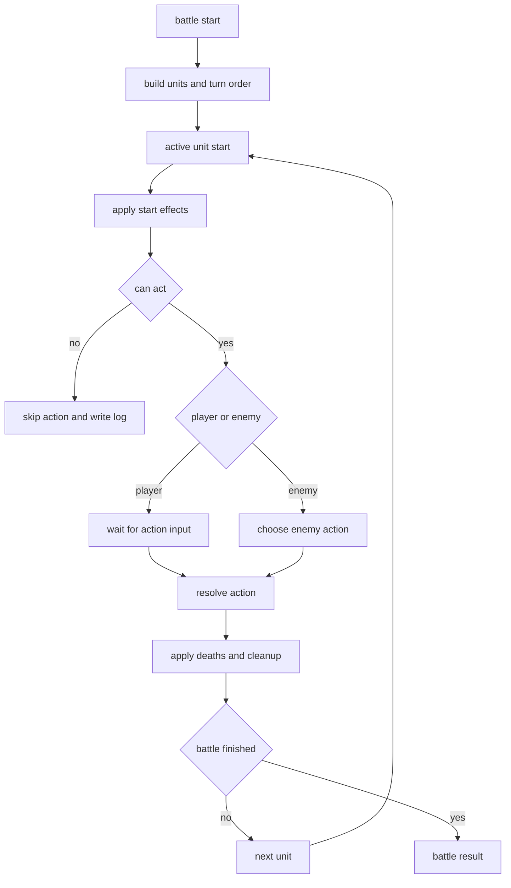

# 战斗系统 videcoding 子计划

## 1. 文档定位

本文档聚焦 [`无限世界`](../纯前端AI人物驱动回合制游戏_MVP设计稿.md) 的 MVP 战斗系统实现规划，作为 [`plans/MVP_videcoding_实施计划.md`](./MVP_videcoding_实施计划.md) 的战斗专项补充。

适用目标：

- 以纯前端方式实现稳定可验证的回合制战斗
- 先完成规则内核，再接 UI
- 先实现无 AI 也成立的战斗闭环
- 作为后续 Code 模式逐 Episode 构筑时的战斗施工蓝图

---

## 2. 战斗系统边界

根据 [`纯前端AI人物驱动回合制游戏_MVP设计稿.md:265`](../纯前端AI人物驱动回合制游戏_MVP设计稿.md:265) 到 [`纯前端AI人物驱动回合制游戏_MVP设计稿.md:328`](../纯前端AI人物驱动回合制游戏_MVP设计稿.md:328)，MVP 战斗系统必须满足以下边界：

### 2.1 必做内容

- 3 人小队对 1 到 3 名敌人
- 严格回合制
- 按速度排序行动
- 玩家每回合从菜单中选择操作
- 支持普攻、技能、防御
- 支持护盾、中毒、破甲、充能、眩晕五种机制
- 支持普通敌、精英敌、Boss 三类敌人行为模板

### 2.2 明确不做内容

MVP 战斗阶段不做：

- 实时战斗
- 复杂站位系统
- 替补系统
- 大量随机组合状态
- 装备体系耦合
- AI 自由创造战斗机制
- 过量演出动画

### 2.3 核心设计原则

战斗系统必须在没有 AI 文本的情况下独立成立，参考 [`纯前端AI人物驱动回合制游戏_MVP设计稿.md:265`](../纯前端AI人物驱动回合制游戏_MVP设计稿.md:265)。

这意味着：

- 所有结算逻辑必须由 [`src/domain/battle`](../src/domain/battle) 与 [`src/domain/formulas`](../src/domain/formulas) 纯函数承担
- AI 或人物台词只能附加在日志与表现层，不能控制胜负规则
- UI 只是战斗状态的展示器与输入器，不能承担规则判断

---

## 3. 战斗模块分层

### 3.1 类型层

战斗相关类型放在 [`src/types`](../src/types)。

建议文件：

- [`src/types/battle.ts`](../src/types/battle.ts)
- [`src/types/character.ts`](../src/types/character.ts)
- [`src/types/effects.ts`](../src/types/effects.ts)

需要先定义的核心结构：

- BattleState
- BattleUnit
- BattleAction
- BattleActionResult
- StatusEffect
- TurnOrderEntry
- BattleLogEntry
- EnemyBrain 或 EnemyPattern
- BattleOutcome

### 3.2 数据层

静态战斗资源放在 [`src/data`](../src/data)。

建议文件：

- [`src/data/skills/skillCatalog.ts`](../src/data/skills/skillCatalog.ts)
- [`src/data/enemies/enemyCatalog.ts`](../src/data/enemies/enemyCatalog.ts)
- [`src/data/constants/statusEffects.ts`](../src/data/constants/statusEffects.ts)
- [`src/data/constants/classes.ts`](../src/data/constants/classes.ts)

### 3.3 规则层

纯逻辑放在 [`src/domain/battle`](../src/domain/battle) 与 [`src/domain/formulas`](../src/domain/formulas)。

建议文件：

- [`src/domain/battle/createBattleState.ts`](../src/domain/battle/createBattleState.ts)
- [`src/domain/battle/getTurnOrder.ts`](../src/domain/battle/getTurnOrder.ts)
- [`src/domain/battle/resolveAction.ts`](../src/domain/battle/resolveAction.ts)
- [`src/domain/battle/resolveTurn.ts`](../src/domain/battle/resolveTurn.ts)
- [`src/domain/battle/applyStatusEffects.ts`](../src/domain/battle/applyStatusEffects.ts)
- [`src/domain/battle/checkBattleOutcome.ts`](../src/domain/battle/checkBattleOutcome.ts)
- [`src/domain/battle/enemyAi.ts`](../src/domain/battle/enemyAi.ts)
- [`src/domain/formulas/damage.ts`](../src/domain/formulas/damage.ts)
- [`src/domain/formulas/heal.ts`](../src/domain/formulas/heal.ts)
- [`src/domain/formulas/shield.ts`](../src/domain/formulas/shield.ts)

### 3.4 状态装配层

与页面交互相关的战斗状态应由 [`src/app/store/battleSlice.ts`](../src/app/store/battleSlice.ts) 负责。

职责包括：

- 初始化一场战斗
- 记录当前行动角色
- 提交玩家动作
- 驱动敌人行动
- 记录战斗日志
- 输出胜负结果
- 将战斗结果回写单局状态

### 3.5 表现层

战斗页面与可复用战斗组件放在：

- [`src/screens/battle/BattleScreen.tsx`](../src/screens/battle/BattleScreen.tsx)
- [`src/components/battle/BattleLog.tsx`](../src/components/battle/BattleLog.tsx)
- [`src/components/battle/SkillMenu.tsx`](../src/components/battle/SkillMenu.tsx)
- [`src/components/battle/UnitPanel.tsx`](../src/components/battle/UnitPanel.tsx)
- [`src/components/battle/TurnBanner.tsx`](../src/components/battle/TurnBanner.tsx)

---

## 4. MVP 战斗规则最小定义

### 4.1 单位属性

MVP 阶段建议每个战斗单位只保留：

- hp
- maxHp
- sp
- maxSp
- atk
- def
- spd
- shield
- alive

扩展字段可保留但先不启用：

- critRate
- critDamage
- resistance
- taunt

### 4.2 行动类型

玩家与敌人动作统一抽象为：

- attack
- skill
- defend
- wait 禁用或仅内部保留

### 4.3 目标类型

与设计稿保持一致，参考 [`纯前端AI人物驱动回合制游戏_MVP设计稿.md:515`](../纯前端AI人物驱动回合制游戏_MVP设计稿.md:515)。

建议支持：

- self
- ally
- enemy
- all_enemies

MVP 可暂不做：

- all_allies
- random_enemy
- dead_ally

### 4.4 状态机制范围

只实现以下五种：

- shield
- poison
- breakArmor
- charge
- stun

它们应当被实现为统一状态结构，而不是散落的布尔值。

建议统一结构：

- id
- type
- sourceUnitId
- duration
- stacks
- power
- flags

---

## 5. 五种核心机制的落地建议

### 5.1 护盾

设计目标：

- 抵消即将受到的部分伤害
- 优先于生命值扣减
- 可作为守护者和支援者核心机制

结算建议：

1. 先计算最终伤害
2. 先扣 shield
3. 剩余伤害再扣 hp
4. shield 不跨战永久保留

### 5.2 中毒

设计目标：

- 提供稳定持续伤害
- 强化术士定位
- 增加回合管理感

结算建议：

- 在中毒单位回合开始或结束时触发，必须全局统一
- 每层或每个 effect 具有 power
- 持续回合数递减至 0 后移除

MVP 建议统一为：

- 回合开始触发
- 不可暴击
- 无视防御或仅部分受防御影响，需在实现前固定规则

### 5.3 破甲

设计目标：

- 给战士定位明确的单体突破能力
- 让后续输出形成组合价值

结算建议：

- 作为 debuff 降低 def
- 不直接减少当前 hp
- 应有持续回合数
- 多层叠加是否允许，必须在第一版写死

MVP 推荐：

- 允许层数叠加
- 每层降低固定防御值或按百分比降低，二选一
- 为避免复杂，第一版更推荐固定值

### 5.4 充能

设计目标：

- 让支援者与技能循环形成节奏
- 提高技能选择而非只打普攻

结算建议：

- 以 sp 回复或 cost 减免的形式实现
- 第一版只做增加 sp
- 不做复杂上限突破

MVP 推荐：

- 充能本质是即时或延后 sp 回复
- 若实现为状态，则在回合开始回复固定值
- 若实现为即时效果，则直接加 sp

第一版更建议先做即时型，以减少理解负担。

### 5.5 眩晕

设计目标：

- 提供明确控场点
- 让精英和 Boss 拥有威胁感

结算建议：

- 被眩晕单位跳过一次行动
- 触发后移除或递减 duration
- 必须在日志中明确提示

MVP 推荐：

- 只处理跳过下一次行动
- 不叠加延长
- 与速度系统兼容但不重排队列

---

## 6. 战斗回合流程设计

### 6.1 单回合标准流程

推荐固定顺序：

1. 选择当前行动单位
2. 结算回合开始状态
3. 若被眩晕则跳过
4. 若为玩家单位则等待输入
5. 若为敌人单位则自动选行动
6. 执行动作与即时效果
7. 写入战斗日志
8. 结算死亡与状态清理
9. 检查胜负
10. 进入下一行动单位

### 6.2 战斗状态流转图

### 6.3 行动顺序原则

MVP 推荐：

- 每轮按 spd 从高到低排序
- 同速时按固定稳定顺序比较 id
- 行动后进入下一单位
- 一轮结束再重新生成顺序，或在第一版中直接按固定队列轮转

第一版推荐：

- 战斗开始时生成队列
- 每轮结束后按存活单位重新排序
- 避免动态插队机制

---

## 7. 角色职业与技能模板规划

### 7.1 守护者

定位：

- 前排生存
- 护盾
- 保护队友

推荐技能模板：

- 单体攻击并附加低额破甲
- 为全队施加护盾

### 7.2 战士

定位：

- 单体输出
- 破甲连段

推荐技能模板：

- 高倍率单体攻击
- 攻击并施加破甲

### 7.3 术士

定位：

- 群体压制
- 中毒
- 低概率控场

推荐技能模板：

- 全体敌人伤害
- 单体伤害附加中毒或低概率眩晕

### 7.4 支援者

定位：

- 治疗
- 护盾
- 充能辅助

推荐技能模板：

- 单体治疗
- 回复生命并增加 sp

---

## 8. 敌人设计计划

### 8.1 普通敌

特点：

- 单一攻击模式
- 低复杂度
- 用于基础校验与数值验证

建议最先实现：

- 狂化拾荒者：单体物理攻击
- 裂界兽幼体：攻击附带轻微中毒

### 8.2 精英敌

特点：

- 两种技能循环
- 更高数值压力
- 强调某一种状态机制

建议实现：

- 教团执行者：普通攻击与破甲技能轮换
- 晶核傀儡：护盾与高伤单体技能轮换

### 8.3 Boss

特点：

- 两阶段即可
- 每阶段一种清晰机制
- 不做复杂脚本编排系统

建议第一版 Boss：

- 阶段一：稳定单体攻击加召唤护盾
- 阶段二：附带群体压制或眩晕技能

Boss 核心要求：

- 有明显阶段切换提示
- 有足够日志表达
- 规则实现可测试

---

## 9. 数值实现策略

### 9.1 第一版目标

第一版不是追求绝对平衡，而是追求：

- 可解释
- 可测
- 不容易崩坏
- 有基本策略选择

### 9.2 公式原则

所有公式应集中在 [`src/domain/formulas`](../src/domain/formulas) 中，不允许散落在组件里。

建议最低公式集：

- [`damage.resolveDamage()`](../src/domain/formulas/damage.ts:1)
- [`heal.resolveHeal()`](../src/domain/formulas/heal.ts:1)
- [`shield.resolveShieldGain()`](../src/domain/formulas/shield.ts:1)

### 9.3 第一版推荐方向

可采用简单稳定模型：

- 伤害与 atk、def、skill power 相关
- 治疗与 atk 或固定 power 相关
- 护盾与固定 power 或 atk 相关
- 中毒按固定值持续结算
- 破甲按固定值减防

要避免：

- 多重乘区
- 暴击体系耦合
- 命中闪避体系
- 复杂抗性系统

---

## 10. UI 接入策略

### 10.1 战斗页最小信息结构

根据 [`纯前端AI人物驱动回合制游戏_MVP设计稿.md:460`](../纯前端AI人物驱动回合制游戏_MVP设计稿.md:460)，MVP 战斗页应优先显示：

- 左侧队伍状态
- 右侧敌人状态
- 当前行动角色
- 技能按钮
- 战斗日志
- 简短角色语音或气泡文本

### 10.2 UI 设计原则

- 信息优先，动画靠后
- 面板结构稳定
- 当前行动者必须显著高亮
- 技能按钮必须显示 cost 与效果摘要
- 状态效果必须可视化但不堆满屏幕

### 10.3 第一版组件拆分

建议组件：

- [`src/components/battle/UnitPanel.tsx`](../src/components/battle/UnitPanel.tsx)
- [`src/components/battle/SkillMenu.tsx`](../src/components/battle/SkillMenu.tsx)
- [`src/components/battle/BattleLog.tsx`](../src/components/battle/BattleLog.tsx)
- [`src/components/battle/StatusBadge.tsx`](../src/components/battle/StatusBadge.tsx)
- [`src/components/battle/TargetSelector.tsx`](../src/components/battle/TargetSelector.tsx)

---

## 11. 测试重点

战斗系统是 MVP 中最需要先测试的部分。

### 11.1 必测模块

- 伤害公式
- 护盾吸收
- 中毒持续伤害
- 破甲生效与到期
- 眩晕跳过行动
- sp 消耗与恢复
- 回合顺序稳定性
- 胜负判定

### 11.2 推荐测试目录

- [`src/tests/battle`](../src/tests/battle)
- [`src/tests/formulas`](../src/tests/formulas)

### 11.3 测试原则

- 先测纯函数
- 再测 battle state 流转
- 最后再做 UI 层交互验证

---

## 12. videcoding 分阶段清单

### Battle Episode 01 类型与状态结构

- 定义 BattleState、BattleUnit、BattleAction、StatusEffect、BattleLogEntry
- 固定状态枚举和行动枚举
- 让类型可承载后续所有机制

完成标志：

- 所有战斗结构可被静态数据驱动

### Battle Episode 02 技能库与敌人库

- 建立首批技能模板
- 建立普通敌、精英敌、Boss 模板
- 固定职业与技能映射关系

完成标志：

- 可通过模板实例化战斗单位

### Battle Episode 03 公式模块

- 实现伤害、治疗、护盾公式
- 明确顺序与边界值处理
- 编写公式测试

完成标志：

- 关键公式用例全部可测

### Battle Episode 04 战斗状态机构建

- 创建 battle state
- 生成 turn order
- 实现当前行动单位推进
- 实现胜负判定

完成标志：

- 可在无 UI 环境下推进回合

### Battle Episode 05 行动解析与状态机制

- 实现普攻、技能、防御
- 接入护盾、中毒、破甲、充能、眩晕
- 输出结构化日志

完成标志：

- 给定一组输入，可完整跑通一场战斗

### Battle Episode 06 敌人行为模板

- 实现普通敌策略
- 实现精英敌技能循环
- 实现 Boss 阶段切换逻辑

完成标志：

- 敌人能自动行动并形成差异

### Battle Episode 07 Store 与 run 集成

- 将 battle state 接到 [`src/app/store/battleSlice.ts`](../src/app/store/battleSlice.ts)
- 战斗结果回写 run 状态
- 战斗结束返回地图流程

完成标志：

- 战斗可作为节点流程的一部分被调用

### Battle Episode 08 UI 接线

- 构建 BattleScreen
- 接入单位面板、技能菜单、日志
- 支持目标选择与行动提交

完成标志：

- 玩家可在页面中完成一场战斗

### Battle Episode 09 调优与可读性增强

- 优化日志文本
- 增加状态徽标与伤害反馈
- 增强当前回合提示

完成标志：

- 战斗过程清晰可读

---

## 13. 验收口径

只有满足以下条件，战斗子系统才算达到 MVP 可接入标准：

- 玩家队伍可与 1 到 3 名敌人稳定战斗
- 普攻、技能、防御可正常执行
- 护盾、中毒、破甲、充能、眩晕均可正确结算
- 敌人可自动行动
- 精英敌与 Boss 存在明显机制差异
- 战斗日志能解释关键结算
- 战斗结束后能正确输出胜负与奖励
- 脱离 AI 也能独立可玩

---

## 14. 交给后续 Code 模式的执行约束

后续如果进入 Code 模式开发战斗系统，应遵守以下顺序：

1. 先类型
2. 再数据模板
3. 再公式
4. 再状态机
5. 再状态机制
6. 再敌人行为
7. 再 store 集成
8. 最后接 UI

禁止直接从 [`BattleScreen.tsx`](../src/screens/battle/BattleScreen.tsx) 倒推规则实现。

---

## 15. 一句话战斗施工方针

MVP 战斗系统的 videcoding 方针是：

**先做一个纯函数可验证、规则稳定、日志可解释的回合制内核，再把它接进页面变成可玩的战斗界面。**
