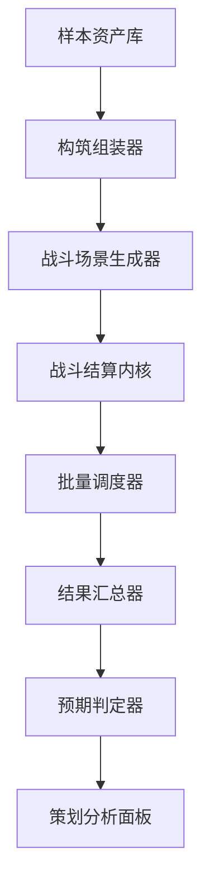

# 实际战斗测试平台实现方案

## 1. 目标与边界

本方案基于 [`数值验算/battle_test_platform.html`](数值验算/battle_test_platform.html)、[`数值验算/数值公式v1.1.md`](数值验算/数值公式v1.1.md)、[`数值验算/无限世界_技能与装备分层系统初稿.md`](数值验算/无限世界_技能与装备分层系统初稿.md) 的现有规则整理，只回答以下问题：

- 实际战斗测试平台应包含哪些模块
- 角色、装备、技能的数据结构如何定义，才能支持后续 100 × 100 × 100 的典型案例组合测试
- 测试样本如何分层抽样，避免纯随机失真
- 后续从 10 类原型扩展到 100 类原型时，应沿哪些维度展开
- 测试输出哪些指标，以及如何判定结果是否符合预期

本方案不包含代码实现，不修改任何非 Markdown 文件。

---

## 2. 对现有材料的关键复用结论

### 2.1 当前平台已经可复用的底层规则

现有 [`derivedStats()`](数值验算/battle_test_platform.html:236) 已明确六维属性到战斗面板的导出公式，可直接作为后续平台的基础派生层。

现有 [`computeDamage()`](数值验算/battle_test_platform.html:289)、[`computeHeal()`](数值验算/battle_test_platform.html:296)、[`computeShield()`](数值验算/battle_test_platform.html:301)、[`statusChance()`](数值验算/battle_test_platform.html:283)、[`simulateATB()`](数值验算/battle_test_platform.html:351)、[`simulateSPCycle()`](数值验算/battle_test_platform.html:371) 已给出以下可复用骨架：

- 属性导出
- 命中
- 伤害
- 暴击
- 控制概率
- 治疗与护盾
- ATB 行动条
- SP 循环
- Burst 资源
- 阶段压制
- Boss 人数补偿

这意味着新平台不应推倒重来，而应在现有结算内核之外补齐样本管理、组合编排、批量执行与结果判读。

### 2.2 当前平台的结构性不足

现有 [`buildTemplates()`](数值验算/battle_test_platform.html:412) 只有 9 个 build 模板，[`createSkillBook()`](数值验算/battle_test_platform.html:464) 只有少量技能，且 [`createBehavior()`](数值验算/battle_test_platform.html:484) 采用硬编码行为逻辑，因此更像公式验证器，不是可扩展的实际战斗测试平台。

后续若要支撑 100 角色、100 装备、100 技能与混合搭配测试，缺口主要有 4 个：

- 样本库缺少统一主键、标签、层级与权重
- 角色、装备、技能未解耦，无法稳定重组
- 缺少分层抽样与对照组编排
- 缺少面向策划的结果判定口径

### 2.3 必须继承的设计方向

根据 [`数值公式v1.1.md`](数值验算/数值公式v1.1.md) 与 [`无限世界_技能与装备分层系统初稿.md`](数值验算/无限世界_技能与装备分层系统初稿.md)，后续平台必须满足：

- 六维属性驱动，不设固定职业
- 阶段压制强，差 2 阶正常不可战胜
- 技能与装备分层不是单纯倍率差，而是规则权限差
- 技能与装备必须成为构筑入口，而不是纯面板附加
- 平台要能观察裸属性、装备修正、技能修正、阶段修正叠加后的实战表现

---

## 3. 实际战斗测试平台的目标结构

建议将平台拆为 8 个模块。



### 3.1 样本资产库

职责：维护角色原型、装备原型、技能原型、敌方场景原型的标准化数据。

最低内容：

- 主键 id
- 名称 name
- 层级 tier
- 阶段 realm
- 标签 tags
- 数值字段 numeric fields
- 规则字段 rules
- 权重 samplingWeight
- 互斥与依赖约束 constraints

这是后续一切批量测试的唯一事实源。

### 3.2 构筑组装器

职责：把角色底板、装备组合、技能组合组装为一个可战斗实体。

输出内容应包括：

- 基础属性
- 装备修正后属性
- 技能列表
- 被动与词条修正
- AI 行为脚本引用
- 战斗前最终派生面板

该模块要解决“同一个角色原型可挂不同装备和技能组合”的问题。

### 3.3 战斗场景生成器

职责：定义一次测试到底是在什么条件下发生。

场景维度至少包括：

- 对战模式：1v1、3v3、Boss 战
- 敌我阶段差 realmGap
- 等级档位 levelBracket
- 场景目标：爆发、续航、控制、治疗、越阶、生存
- 战斗长度：短战、中战、长战
- 随机种子 seed
- 重复次数 repeats

### 3.4 战斗结算内核

职责：沿用现有公式与时序，执行真实战斗。

该模块应继续承接现有 [`computeDamage()`](数值验算/battle_test_platform.html:289)、[`statusChance()`](数值验算/battle_test_platform.html:283)、[`simulateATB()`](数值验算/battle_test_platform.html:351) 一类规则，但外层要支持更多来源：

- 装备词条修正
- 技能附加修正
- 特殊机制钩子
- 召唤继承
- 阶段与层级联动修正

### 3.5 批量调度器

职责：把 100 × 100 × 100 的资产空间转化为“可控、可复验、可解释”的测试批次。

它不应无脑全排列，而应支持：

- 分层抽样
- 笛卡尔对照组
- 定向回归组
- 极端压力组
- 种子重放

### 3.6 结果汇总器

职责：把单场日志聚合为可读指标。

输出至少分 3 层：

- 单次战斗日志
- 同组多次战斗统计
- 全局原型分布统计

### 3.7 预期判定器

职责：用策划规则判断某一构筑或某一类原型是否偏离设计目标。

它不是判断输赢而已，而是判断：

- 是否胜在应胜维度
- 是否输在合理原因
- 是否出现越层级越位格异常
- 是否出现资源或控制失真

### 3.8 策划分析面板

职责：把结果翻译成策划可处理结论。

建议至少包含：

- 原型胜率热力图
- 原型对原型克制表
- 分阶段表现表
- 技能与装备联动异常榜
- 输出、承伤、治疗、控制四大主轴分布图
- 不符合预期样本清单

---

## 4. 数据结构方案

目标不是把 100 个角色、100 个装备、100 个技能写成 300 个孤立对象，而是先建立统一骨架，让后续可批量扩展。

## 4.1 角色数据结构

建议角色对象至少包含以下字段。

```text
CharacterPrototype {
  id
  name
  roleAxis
  realm
  levelBracket
  growthPlan
  attributeProfile
  derivedBias
  equipmentSlots
  skillLoadoutRules
  aiProfile
  tags
  samplingWeight
  expectedStrengthBand
}
```

字段说明：

- `id`：唯一编号，例如 C001
- `name`：原型名
- `roleAxis`：主定位，例如 burst、control、tank、support、summon
- `realm`：阶段
- `levelBracket`：等级档位，例如 1、10、30、60、100
- `growthPlan`：成长方案引用，兼容现有 [`GROWTH_PLAN_A`](数值验算/battle_test_platform.html:204)
- `attributeProfile`：六维属性分配模板
- `derivedBias`：预期强化方向，例如 crit、speed、heal、status
- `equipmentSlots`：可挂载槽位定义，建议武器 1、防具 1、饰品 2，呼应 [`推荐装备位`](数值验算/无限世界_技能与装备分层系统初稿.md:447)
- `skillLoadoutRules`：允许搭配的技能类别、层级上限、同类技能上限
- `aiProfile`：行为逻辑标签，不直接写死脚本
- `tags`：多标签检索
- `samplingWeight`：抽样权重
- `expectedStrengthBand`：预期强度带，用于后续判断是否偏离

其中 `attributeProfile` 建议拆为：

```text
attributeProfile {
  STR
  AGI
  INT
  SPI
  CHA
  LUK
  flatBonuses
}
```

### 4.1.1 角色结构设计原则

- 角色原型只定义底板与倾向，不绑定唯一装备和唯一技能
- 角色需要保留标签，便于分层抽样
- 角色需要同时标记战斗定位与构筑风险，例如 highVariance、resourceHungry、antiBossWeak

## 4.2 装备数据结构

建议装备统一为可组合对象。

```text
EquipmentPrototype {
  id
  name
  slot
  tier
  realmRecommended
  statMods
  percentMods
  conversionRules
  skillHooks
  stageHooks
  tags
  exclusivity
  samplingWeight
  expectedUseCases
}
```

字段说明：

- `slot`：weapon、armor、accessory
- `tier`：I 到 V，呼应 [`装备五层级设计`](数值验算/无限世界_技能与装备分层系统初稿.md:456)
- `realmRecommended`：推荐阶段，不等于硬限制
- `statMods`：固定属性修正
- `percentMods`：百分比修正
- `conversionRules`：属性转化，呼应 [`属性转化`](数值验算/无限世界_技能与装备分层系统初稿.md:702)
- `skillHooks`：技能修正，呼应 [`技能修正`](数值验算/无限世界_技能与装备分层系统初稿.md:715)
- `stageHooks`：阶段相关修正，呼应 [`阶段相关修正`](数值验算/无限世界_技能与装备分层系统初稿.md:725)
- `exclusivity`：互斥规则，避免不合法叠加
- `expectedUseCases`：预期适配的原型标签

### 4.2.1 装备建模建议

装备至少分三类数据层：

- 面板层：直接进入现有属性导出字段
- 机制层：在结算时附加修正
- 约束层：决定能否与某些技能或其他装备同挂

这能支撑后续高层级装备的规则型特效，而不污染基础公式。

## 4.3 技能数据结构

建议技能采用统一技能对象，不按硬编码函数散落。

```text
SkillPrototype {
  id
  name
  tier
  category
  damageType
  scaling
  cost
  targeting
  timing
  formulas
  statusPayload
  shieldPayload
  summonPayload
  triggerRules
  masteryRequirement
  tags
  samplingWeight
  expectedPerformance
}
```

字段说明：

- `tier`：I 到 V，呼应 [`主动技能五层级设计`](数值验算/无限世界_技能与装备分层系统初稿.md:86)
- `category`：damage、control、heal、shield、summon、buff、debuff、hybrid
- `damageType`：physical、magical、true、special
- `scaling`：主收益与次收益来源
- `cost`：SP、Burst、生命、护盾、前置状态等成本
- `targeting`：单体、群体、自身、最低血、最高威胁等
- `timing`：即时、生效回合、持续回合
- `formulas`：倍率与修正表达
- `statusPayload`：控制或异常内容
- `shieldPayload`：护盾生成内容
- `summonPayload`：召唤内容
- `triggerRules`：条件触发、追加结算、引爆、再动等
- `masteryRequirement`：最低阶段、最低属性、特定武器等要求，呼应 [`掌握条件建议`](数值验算/无限世界_技能与装备分层系统初稿.md:336)
- `expectedPerformance`：该技能的设计职责，例如 singleBurst、antiHeal、tempoControl

### 4.3.1 技能公式层建议

技能内部的效果不应只有一个 `skillRate`，而应拆成 payload 列表。

```text
formulas = [
  damage payload,
  control payload,
  heal payload,
  shield payload,
  resource payload
]
```

这样一项技能可天然支持复合收益，例如伤害加控制、治疗加护盾、召唤加统御增益。

## 4.4 组合测试所需的索引字段

为了支撑 100 × 100 × 100 的资产空间，三类对象都必须带统一索引标签：

```text
tags {
  offenseAxis
  defenseAxis
  tempoAxis
  resourceAxis
  varianceAxis
  antiStageAxis
  antiBossAxis
  synergyAxis
}
```

这些标签是后续抽样、回归、异常定位的核心，不可省略。

---

## 5. 为什么不直接做 100 × 100 × 100 全排列

100 × 100 × 100 等于 1,000,000 种单边构筑，若再考虑敌方组合、不同阶段差、不同等级档、随机重复次数，测试规模会迅速膨胀到不可读。

因此推荐把资产空间分成两层：

- 资产层：完整维护 100 角色、100 装备、100 技能
- 测试层：按分层抽样与目标场景生成有限但覆盖关键结构的测试批次

也就是说，目标是“可代表整体空间”，不是“穷举整个空间”。

---

## 6. 分层抽样方案

建议使用四段式抽样，而不是纯随机。

## 6.1 第一层：基础分桶

先按以下维度为角色、装备、技能分别分桶：

- 阶段 realm
- 层级 tier
- 主定位 roleAxis
- 主收益属性 primaryStat
- 资源类型 resourceType
- 波动特性 variance
- 机制标签 mechanismTag

纯随机的问题在于，容易过多抽到中庸样本，极端与边界样本覆盖不足。

## 6.2 第二层：代表样本抽样

每个桶至少抽出以下样本：

- 1 个中位样本
- 1 个上边界样本
- 1 个下边界样本
- 1 个机制特化样本
- 1 个高波动样本

这样才能避免平台只验证平均值，不验证风险边界。

## 6.3 第三层：对照组编排

每个测试批次至少包含 4 种对照方式：

1. 同角色，不同装备，不同技能
2. 同角色，同技能，不同装备
3. 同角色，同装备，不同技能
4. 同定位，不同角色底板

这四类对照能拆解“到底是谁造成强弱差异”。

## 6.4 第四层：压力与异常组

除代表样本外，必须单独建立压力组：

- 高频行动组
- 高频暴击组
- 高频控制组
- 护盾叠层组
- 回复拖回组
- 越阶挑战组
- Boss 人数补偿组
- 召唤继承组

这些组的作用不是求平均，而是找失真点。

## 6.5 推荐测试批次比例

建议单轮测试批次按以下比例组成：

- 40% 标准代表组
- 25% 交叉对照组
- 20% 压力极端组
- 10% 越阶与 Boss 专项组
- 5% 历史回归组

这样既能覆盖主流体验，也能盯住爆炸联动。

---

## 7. 10 类典型角色原型维度

下面 10 类不是最终 100 个角色，而是用于扩展的母维度。

| 原型类 | 主属性轴 | 战斗职责 | 关键风险 | 扩展方向 |
|---|---|---|---|---|
| 重击战士 | STR | 单体爆发、破防 | 容易被风筝 | 斩杀、破甲、反击 |
| 敏捷突袭者 | AGI | 先手、连击、收割 | 身板脆 | 追击、再动、背刺 |
| 暴击赌徒 | AGI + LUK | 高波动爆发 | 稳定性差 | 暴击转资源、暴伤极化 |
| 爆发术师 | INT | 法术爆发 | 资源压力高 | 蓄力、穿透、范围爆发 |
| 控场术师 | INT + SPI | 控制、削弱 | 对高抗目标失效 | 连控、沉默、异常引爆 |
| 神官医者 | SPI + CHA | 治疗、驱散、护盾 | 输出不足 | 溢疗转盾、净化、保命 |
| 统御指挥者 | CHA + SPI | 团队增幅、召唤支援 | 单兵能力弱 | 光环、召唤协同、再动支援 |
| 召唤契约者 | CHA + INT | 召唤、分摊战场 | 节奏慢 | 多召唤、继承增强、替身 |
| 壁垒守护者 | STR + SPI | 承伤、护盾、反制 | 清场能力弱 | 嘲讽、反伤、减伤域 |
| 全能六边形 | 均衡 | 多场景稳定 | 上限不足 | 工具箱、适配型构筑 |

扩展到 100 个角色时，建议按以下方式展开：

- 每类母维度扩展 8 到 12 个变种
- 变种差异来自阶段、等级档、资源倾向、技能层级入口、装备适配方向
- 每类至少包含 1 个低方差样本和 1 个高方差样本

---

## 8. 10 类典型装备原型维度

| 原型类 | 部位倾向 | 核心作用 | 风险点 | 扩展方向 |
|---|---|---|---|---|
| 重武器 | 武器 | 提升 PATK 与破防 | 速度下降 | 破甲、斩杀、反震 |
| 迅击武器 | 武器 | 提升 SPD、命中、连击 | 单次倍率低 | 连段、追击、先手 |
| 奥术法器 | 武器 | 提升 MATK 与法术倍率 | 资源耗用高 | 蓄能、穿透、范围 |
| 控制媒介 | 武器或饰品 | 提升异常命中与控场效果 | 对免控环境弱 | 沉默、束缚、恐惧 |
| 守护重甲 | 防具 | HP、PDEF、减伤 | 机动性差 | 反伤、抗暴、护盾增益 |
| 灵纹法袍 | 防具 | MDEF、抗性、治疗或护盾强化 | 物理抗压一般 | 净化、回蓝、法盾 |
| 统御徽记 | 饰品 | LEAD、团队光环、召唤继承 | 个人输出弱 | 队伍增益、召唤协同 |
| 幸运护符 | 饰品 | 暴击、暴伤、事件偏正 | 下限不稳 | 赌博技、暴击转 Burst |
| 转化秘器 | 饰品 | 属性转化、特殊构筑入口 | 平均面板低 | SPI 转抗性、CHA 转终伤 |
| 越阶遗物 | 任意 | 对高阶段敌人提供有限穿透 | 容易破坏设定 | 条件触发、低覆盖率 |

扩展到 100 个装备时，建议按：

- 部位层分布：武器 30、防具 25、饰品 45
- 层级层分布：I 到 V 呈金字塔，避免高层级泛滥
- 同一原型类中区分面板型、机制型、混合型

---

## 9. 10 类典型技能原型维度

| 原型类 | 层级重心 | 主要作用 | 风险点 | 扩展方向 |
|---|---|---|---|---|
| 基础打击技 | I | 稳定输出、低成本循环 | 上限有限 | 连段底盘、攒资源 |
| 爆发斩击技 | II 到 III | 单体高伤、破甲、斩杀 | 容易溢出 | 处决、破防、对 Boss 特化 |
| 连击追击技 | I 到 III | 高频出手、追击触发 | 容易吃速度膨胀 | 连段、再动、收割 |
| 爆裂法术技 | II 到 IV | 高倍率法伤、范围清场 | 耗 SP 高 | 蓄力、穿透、元素副效 |
| 单体控制技 | I 到 III | 定点封锁高威胁目标 | 命中不稳 | 沉默、束缚、魅惑 |
| 群体压制技 | III 到 IV | 群控、节奏改写 | 容易失衡 | 恐惧域、行动条压制 |
| 治疗恢复技 | I 到 III | 回复、续航、净化 | 拖回过强 | HOT、群疗、驱散 |
| 护盾守护技 | I 到 IV | 吸收伤害、保核心位 | 护盾叠层失真 | 反伤盾、溢疗转盾 |
| 召唤契约技 | III 到 V | 召唤物制造额外行动与承伤面 | 复杂度高 | 继承面板、献祭、协同 |
| 权能规则技 | IV 到 V | 打断、改命、反越阶 | 最容易破坏系统 | 代死、免死、封域、真伤限制 |

扩展到 100 个技能时，建议：

- 先按 10 类各扩 6 到 8 个稳定样本
- 再补 20 到 30 个跨类混合技
- 高层级技能必须附带更高成本、条件或限制，呼应 [`学会 ≠ 完全掌握`](数值验算/无限世界_技能与装备分层系统初稿.md:325)

---

## 10. 测试场景设计

为了让平台结果可解释，建议场景也标准化。

### 10.1 基础场景类型

- `DuelStandard`：同阶段 1v1 标准对抗
- `SquadSkirmish`：3v3 小队战
- `BossPressure`：3v1 Boss 压力战
- `CrossRealmTrial`：越阶挑战
- `LongFightSustain`：长战续航测试
- `BurstWindow`：短战爆发测试
- `ControlReliability`：控制稳定性测试
- `ShieldAttrition`：护盾与回复拉扯测试

### 10.2 每个场景的固定参数

每个场景模板都应固定：

- 参战人数
- 战斗回合上限或 tick 上限
- 允许随机波动范围
- 敌方原型池
- 统计口径
- 期望表现标签

这样后续看到异常结果时，可以直接追溯是场景导致还是构筑导致。

---

## 11. 测试输出指标

结果指标建议分为 6 组。

## 11.1 胜负与效率指标

- `winRate`
- `drawRate`
- `avgBattleLength`
- `avgTurnToFirstKill`
- `avgRemainingHP`
- `avgRemainingSP`

## 11.2 输出与承伤指标

- `avgDamageDealt`
- `avgDamageTaken`
- `peakSingleHit`
- `damageShare`
- `effectiveDPS`
- `damageIntoShieldRatio`

## 11.3 控制与命中指标

- `hitRate`
- `critRate`
- `controlAttemptRate`
- `controlSuccessRate`
- `controlEffectiveTurnGain`
- `antiControlSurvivalRate`

## 11.4 治疗与护盾指标

- `totalHeal`
- `effectiveHeal`
- `overhealRate`
- `totalShield`
- `shieldAbsorbValue`
- `shieldWasteRate`

## 11.5 资源与节奏指标

- `spStarveRate`
- `burstReadyTurn`
- `skillUseDistribution`
- `basicAttackFallbackRate`
- `avgActionCount`
- `atbTempoAdvantage`

## 11.6 结构风险指标

- `varianceScore`
- `antiBossGap`
- `crossRealmBreakthroughRate`
- `oneSidedSuppressionRate`
- `stallRate`
- `unexpectedComboFrequency`

其中最关键的不是单一均值，而是分布、方差与边界值。

---

## 12. 符合预期的判定标准

判定标准不能只看胜率，否则会误判很多构筑。

建议采用四层判定。

## 12.1 第一层：规则正确性

判断是否违反既有数值框架。

符合预期需满足：

- 派生属性与 [`数值公式v1.1.md`](数值验算/数值公式v1.1.md) 一致
- 阶段差导致的伤害、治疗、控制趋势不违背既有设定
- 高层级技能与装备不会无条件突破阶段压制设定

若这一层不通过，属于实现或建模错误，不是平衡问题。

## 12.2 第二层：定位正确性

判断原型是否赢在该赢的地方。

例如：

- 重击战士应在短战爆发高于全能六边形
- 神官医者应在长战有效治疗显著高于爆发术师
- 控场术师应在 `controlSuccessRate` 与 `controlEffectiveTurnGain` 上领先非控制原型
- 统御指挥者应在团队场景比单挑场景更强

若角色赢了但赢因错误，也判定为不符合预期。

## 12.3 第三层：层级与位格正确性

用于校验世界观边界。

建议标准：

- 同阶段同层级对抗中，主流原型胜率分布不应极端集中
- 差 1 阶可通过特化构筑挑战，但不应稳定碾压
- 差 2 阶默认应显著劣势，仅少量越阶机制在特定条件下可形成低概率突破
- 差 3 阶原则上不应成为常规可打样本

若高频出现低层级、低阶段样本无条件越阶稳定取胜，判定为严重失真。

## 12.4 第四层：资源与对局体验正确性

用于防止战斗节奏崩坏。

建议标准：

- 高爆发构筑可以资源吃紧，但不能大面积两轮后瘫痪
- 控制构筑可以压制节奏，但不能稳定让对手长期无操作
- 治疗与护盾构筑可以拖长战斗，但不能把标准战斗大面积拖成无终局
- 高速构筑行动优势应明显，但不能在常规对局形成不可交互的行动碾压

---

## 13. 推荐的判定输出格式

建议每个测试对象最终输出一个四段结论：

```text
结论等级 = 通过 / 关注 / 失真 / 阻断

判定摘要 =
- 规则正确性
- 定位正确性
- 层级位格正确性
- 节奏与资源正确性

主要异常 = 3 条以内

建议动作 =
- 保持
- 降低数值
- 增加约束
- 提高成本
- 下调触发率
- 加入互斥
```

这样父任务后续实现时，可直接做成面板上的策划结论区。

---

## 14. 从 10 扩展到 100 的具体生成建议

### 14.1 角色扩展规则

- 10 类母原型 × 每类 10 个子原型 = 100
- 子原型变化来源：阶段、等级档、属性偏斜、AI 风格、技能层级入口、资源压力
- 每类至少保留：标准型、极端型、高方差型、低方差型各 1 个

### 14.2 装备扩展规则

- 10 类母原型先各做 6 到 8 个稳定款
- 其余名额用于跨机制混合装备与越阶特化装备
- 高层级装备保持稀少，不在样本池中平均分布

### 14.3 技能扩展规则

- 先保证 I 到 III 级技能覆盖全基础战斗职责
- 再补 IV 到 V 级规则型技能
- 高层级技能必须绑定掌握条件、资源代价或触发门槛

---

## 15. 父任务后续实现时最关键的落地点

后续真正落地时，建议按以下顺序推进：

1. 先把角色、装备、技能统一数据化
2. 再把现有硬编码行为改成 `aiProfile + skill policy` 驱动
3. 再实现分层抽样与批量调度
4. 最后做结果判定与策划分析面板

原因很简单：

- 没有统一数据结构，就无法支撑 100 × 100 × 100
- 没有分层抽样，就会被随机结果误导
- 没有判定标准，就只会得到一堆胜率数字，无法指导策划

---

## 16. 一句话结论

实际战斗测试平台不应继续停留在“少量 build 验公式”的层面，而应升级为一个由样本资产库、构筑组装器、场景生成器、战斗内核、批量调度器、结果汇总器、预期判定器、策划分析面板组成的测试系统；其中最关键的是先把角色、装备、技能标准化建模，再通过分层抽样和明确判定标准，把 100 × 100 × 100 的巨大组合空间压缩成可复验、可解释、可指导平衡的测试批次。