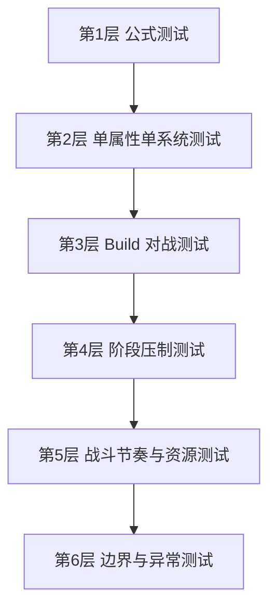

# 《无限世界》数值与战斗系统 v3 测试方案

> 本文基于 [`无限世界_数值与战斗系统初稿_v3.md`](无限世界_数值与战斗系统初稿_v3.md) 制定，目标不是只测几个样板战斗，而是建立一套 **覆盖公式正确性、战斗节奏、阶段压制、技能资源、必杀技资源、构筑差异、边界情况、异常输入、玩家极端玩法** 的完整测试体系。
>
> 这份测试方案的用途包括：
>
> 1. 在纸面阶段验证公式是否合理
> 2. 在原型阶段验证数值体感是否符合设计目标
> 3. 在后续实装时作为程序测试、策划验算、AI 自动对战测试的基础清单
>
> 本方案默认测试对象为单机 PVE 数值系统，不讨论联网同步问题。

---

# 1. 测试总目标

v3 的核心目标可以拆成以下 8 个大测试目标：

1. **基础属性与导出公式正确**
2. **等级成长与自由加点规模合理**
3. **不同 build 的战斗定位清晰**
4. **ATB 节奏符合预期，不出现高敏无限行动**
5. **阶段压制符合设定，差 2 阶正常不可正面对拼**
6. **SP 与必杀技资源节奏可控**
7. **技能、护盾、治疗、控制等子系统不会失衡**
8. **边界情况与极端玩法不会把系统打穿**

---

# 2. 测试分层结构

整个测试体系建议拆成 6 层。



六层的作用分别是：

## 第 1 层：公式测试
验证 [`MaxHP`](无限世界_数值与战斗系统初稿_v3.md:463)、[`MaxSP`](无限世界_数值与战斗系统初稿_v3.md:478)、[`PATK`](无限世界_数值与战斗系统初稿_v3.md:491)、[`MATK`](无限世界_数值与战斗系统初稿_v3.md:499) 等导出公式是否正确计算。

## 第 2 层：单属性单系统测试
验证单项属性是否真的产生预期效果，例如 AGI 是否显著影响 ATB、CHA 是否真的让 [`LEAD`](无限世界_数值与战斗系统初稿_v3.md:438) 有战斗价值。

## 第 3 层：Build 对战测试
验证力量流、敏捷流、智力流、精神流、魅力流、幸运流、双属性流、平衡流之间是否各有明确优势与弱点。

## 第 4 层：阶段压制测试
验证同阶、差 1 阶、差 2 阶、差 3 阶的战斗结果是否符合设计目标。

## 第 5 层：战斗节奏与资源测试
验证 ATB、SP、必杀技资源、技能循环、拖回合、爆发窗口是否合理。

## 第 6 层：边界与异常测试
验证极端加点、极端装备、极低血线、超高速度、超高防御、极限幸运、极限控制、召唤铺场等情况是否会破坏系统。

---

# 3. 测试角色模板库

为了测试所有条目，建议先建立一套固定测试模板。

## 3.1 测试等级档位

建议固定 5 个测试等级档：

- **T1 档**：1级
- **T2 档**：10级
- **T3 档**：30级
- **T4 档**：60级
- **T5 档**：100级

这样可以覆盖：
- 开局
- 第一阶段末
- 中前期
- 中后期
- 最终期

---

## 3.2 测试阶段档位

建议固定 4 个阶段关系：

- **R0**：同阶
- **R1**：高 1 阶
- **R2**：高 2 阶
- **R3**：高 3 阶

---

## 3.3 测试 build 模板

至少准备 10 套基础测试 build。

### B1 纯力量重击流
- 主属性：STR
- 次属性：SPI
- 目标：测试 HP、PATK、PDEF、重击爆发

### B2 力敏近战流
- 主属性：STR + AGI
- 目标：测试物理输出与出手频率平衡

### B3 纯敏捷闪击流
- 主属性：AGI
- 次属性：LUK
- 目标：测试 ATB、命中、闪避、暴击节奏

### B4 智力爆发术法流
- 主属性：INT
- 次属性：SPI
- 目标：测试 MATK、AACC、爆发伤害

### B5 智精控制流
- 主属性：INT + SPI
- 目标：测试控制命中、持续作战、SP 续航

### B6 纯精神回复流
- 主属性：SPI
- 次属性：CHA
- 目标：测试治疗、护盾、抗性

### B7 魅精神统御流
- 主属性：CHA + SPI
- 目标：测试 LEAD、团队光环、召唤、支配类收益

### B8 幸运暴击流
- 主属性：LUK
- 次属性：AGI
- 目标：测试 CRIT、CDMG、随机偏移体感

### B9 平衡六边形流
- 六维均衡
- 目标：测试“万金油构筑”是否有基本竞争力

### B10 极端偏科流
- 单项属性极限堆叠
- 目标：测试边界是否失控

---

# 4. 基础公式测试

这一部分用于验证所有导出公式是否正确、是否符合预期。

---

## 4.1 HP 公式测试

依据 [`MaxHP`](无限世界_数值与战斗系统初稿_v3.md:463)：

```text
MaxHP = 100 + STR * 9 + SPI * 5 + Level * 4 + FlatHPBonus
```

### 测试场景 HP-01 基础低级角色
- Level = 1
- STR = 15
- SPI = 10
- FlatHPBonus = 0

预期：

```text
100 + 15*9 + 10*5 + 1*4 = 289
```

目标：验证开局 HP 不会过低。

### 测试场景 HP-02 中期重装角色
- Level = 30
- STR = 90
- SPI = 40
- FlatHPBonus = 300

预期：

```text
100 + 810 + 200 + 120 + 300 = 1530
```

目标：验证中期肉盾血量体感。

### 测试场景 HP-03 极限高 STR 角色
- Level = 100
- STR = 300
- SPI = 60
- FlatHPBonus = 1200

预期：

```text
100 + 2700 + 300 + 400 + 1200 = 4700
```

目标：验证后期极限坦克血量是否仍在可控区间。

### 边界测试 HP-E01
- STR = 5
- SPI = 5
- Level = 1
- FlatHPBonus = 0

预期：最脆角色 HP 也不能低到一击即死失去可玩性。

### 边界测试 HP-E02
- STR = 320
- SPI = 320
- Level = 100
- FlatHPBonus = 3000

目标：验证极端作弊或未来高膨胀版本下，数值是否溢出或公式仍可算。

---

## 4.2 SP 公式测试

依据 [`MaxSP`](无限世界_数值与战斗系统初稿_v3.md:478)：

```text
MaxSP = 40 + INT * 4 + SPI * 8 + Level * 2 + FlatSPBonus
```

### 测试场景 SP-01 新手法系
- Level = 1
- INT = 16
- SPI = 14
- FlatSPBonus = 0

预期：

```text
40 + 64 + 112 + 2 = 218
```

### 测试场景 SP-02 控制法师
- Level = 30
- INT = 80
- SPI = 95
- FlatSPBonus = 150

预期：

```text
40 + 320 + 760 + 60 + 150 = 1330
```

### 边界测试 SP-E01
- INT 很低，SPI 很高
- 观察纯精神流是否也能拥有合理施法资源

### 边界测试 SP-E02
- INT 很高，SPI 很低
- 观察玻璃炮是否会因 SP 不足无法支撑玩法

---

## 4.3 PATK 公式测试

依据 [`PATK`](无限世界_数值与战斗系统初稿_v3.md:491)：

```text
PATK = 10 + STR * 2.6 + AGI * 0.7 + Level * 0.5 + WeaponATK + FlatPATKBonus
```

### 测试场景 PATK-01 力量战士
- STR = 80
- AGI = 25
- Level = 30
- WeaponATK = 90
- FlatPATKBonus = 40

预期：

```text
10 + 208 + 17.5 + 15 + 90 + 40 = 380.5
```

### 测试场景 PATK-02 力敏刺客
- STR = 45
- AGI = 85
- Level = 30
- WeaponATK = 70
- FlatPATKBonus = 20

预期：

```text
10 + 117 + 59.5 + 15 + 70 + 20 = 291.5
```

目标：验证敏捷副收益存在，但不会压过力量主收益。

---

## 4.4 MATK 公式测试

依据 [`MATK`](无限世界_数值与战斗系统初稿_v3.md:499)：

```text
MATK = 10 + INT * 2.6 + SPI * 0.8 + Level * 0.5 + WeaponMATK + FlatMATKBonus
```

### 测试场景 MATK-01 爆发法师
- INT = 100
- SPI = 50
- Level = 30
- WeaponMATK = 100
- FlatMATKBonus = 50

预期：

```text
10 + 260 + 40 + 15 + 100 + 50 = 475
```

### 测试场景 MATK-02 智精控制者
- INT = 75
- SPI = 90
- Level = 30
- WeaponMATK = 70
- FlatMATKBonus = 30

预期：

```text
10 + 195 + 72 + 15 + 70 + 30 = 392
```

目标：验证爆发流与控制流的术法面板差异。

---

## 4.5 PDEF / MDEF 公式测试

分别依据 [`PDEF`](无限世界_数值与战斗系统初稿_v3.md:507) 与 [`MDEF`](无限世界_数值与战斗系统初稿_v3.md:515)。

### 测试场景 DEF-01 物理重装
- STR = 100
- AGI = 30
- Level = 30
- ArmorBonus = 120

### 测试场景 DEF-02 法术壁垒
- SPI = 110
- INT = 70
- Level = 30
- ResistBonus = 100

目标：
- 验证 STR 确实主导物防
- 验证 SPI 确实主导法防
- 验证双防不会因等级系数过高而被平均化

---

## 4.6 SPD / HIT / EVA / CRIT / CDMG 公式测试

这是高风险区域，必须重点测。

### 测试场景 SPD-01 普通角色
- AGI = 40
- SPI = 20
- LUK = 10

### 测试场景 SPD-02 高敏角色
- AGI = 140
- SPI = 40
- LUK = 30

### 测试场景 SPD-03 极限高敏
- AGI = 260
- SPI = 60
- LUK = 60

目标：
- 对比不同 SPD 下的 ATB 行动频率
- 验证高敏不会无限行动

### 测试场景 EVA-01 高闪避刺客
- AGI = 180
- LUK = 90
- Level = 60

### 测试场景 HIT-01 高命中射手
- AGI = 130
- INT = 50
- Level = 60
- HitBonus = 50

目标：
- 代入 [`HitChance`](无限世界_数值与战斗系统初稿_v3.md:480) 验证命中率是否落在合理区间
- 检查极限闪避是否仍能被命中下限约束

### 测试场景 CRIT-01 极限暴击流
- AGI = 180
- LUK = 180
- CritBonus = 15%

验证：

```text
CRIT = 5 + 14.4 + 32.4 + 15 = 66.8%
```

目标：验证极限暴击流成立，但仍未到 100%。

### 边界测试 CRIT-E01
- AGI = 300
- LUK = 300
- CritBonus = 40%

目标：验证是否需要总暴击率上限，例如 85%。

---

## 4.7 AACC / ARES / HEALP / LEAD 测试

### 测试场景 CTRL-01 控制术士
- INT = 120
- SPI = 100
- CHA = 40
- LUK = 20

### 测试场景 RES-01 高抗性圣职者
- SPI = 130
- CHA = 80
- LUK = 30

目标：
- 验证 [`StatusChance`](无限世界_数值与战斗系统初稿_v3.md:490) 在强控者打高抗者时仍不是必中

### 测试场景 HEAL-01 专职治疗
- SPI = 140
- INT = 60
- CHA = 80
- HealBonus = 100

目标：验证 [`HEALP`](无限世界_数值与战斗系统初稿_v3.md:430) 是否足够支撑治疗 build。

### 测试场景 LEAD-01 统御核心
- CHA = 150
- SPI = 90
- LUK = 30
- LeadBonus = 40

目标：代入 [`TeamAuraBonus`](无限世界_数值与战斗系统初稿_v3.md:446) 与召唤继承公式，观察魅力在多人战中的价值上限。

---

# 5. 等级成长与加点测试

---

## 5.1 成长曲线测试

目标：验证 1级、10级、30级、60级、100级的成长是否平滑。

### 测试场景 LV-01 固定 3 点成长角色
- 每级固定 3 点
- 每次突破全属性 +1，自由属性 +5
- 构造一名纯力量流角色

记录：
- 总六维
- HP
- PATK
- PDEF
- SPD
- 单技能平均伤害

观察点：
- 10 级是否有成长感
- 30 级是否开始明显成型
- 60 级是否接近成熟 build
- 100 级是否仍可控

### 测试场景 LV-02 平衡成长角色
- 六维均匀分配

目标：验证平衡流不会因为系统过度奖励偏科而完全报废。

### 测试场景 LV-03 极端偏科角色
- 所有自由点几乎全投单属性

目标：验证极端偏科既有优势也有明显缺陷，而不是无脑最优解。

---

# 6. Build 对战测试

这一部分是真正检验“玩法多样性”的核心。

---

## 6.1 1v1 同阶 build 对战矩阵

测试以下组合：

- B1 力量流 vs B3 敏捷流
- B1 力量流 vs B4 智力爆发流
- B3 敏捷流 vs B5 控制流
- B4 爆发法师 vs B6 回复流
- B7 统御流 vs B9 平衡流
- B8 幸运流 vs B2 力敏流

### 目标
看是否存在：
- 某个 build 统治所有对局
- 某个 build 永远打不过任何主流 build
- 某个 build 只能理论成立，实战毫无价值

---

## 6.2 3v3 团队协同测试

必须验证 CHA 与 LEAD 的存在价值。

### 测试场景 TEAM-01 无统御队
- 力量主 C
- 法系副 C
- 治疗辅助

### 测试场景 TEAM-02 统御核心队
- 力量主 C
- 魅精神统御辅助
- 召唤 / 控制副 C

目标：
- 比较总输出
- 比较容错率
- 比较治疗与护盾效果
- 比较长线作战表现

若统御队在 3v3 中没有明显战术价值，说明 CHA 仍偏弱。

---

## 6.3 1v3 与 3v1 测试

### 测试场景 BOSS-01 单 Boss 对三人队
- Boss：高 HP、高抗性、人数补偿开启
- 敌队：标准三人 build

目标：验证 [`BossHPBonus`](无限世界_数值与战斗系统初稿_v3.md:739)、状态抗性补偿、ATB 补偿是否足够。

### 测试场景 BOSS-02 没有补偿的 Boss
与上面对照。

目标：验证人数补偿机制是否必要。

---

# 7. 阶段压制测试

这一部分必须做成标准化测试。

---

## 7.1 同阶对战

### 测试场景 REALM-00
- 相同等级
- 相同 build
- 相同装备层级
- 同阶

目标：确保没有隐藏压制。

---

## 7.2 差 1 阶对战

### 测试场景 REALM-01A
- 高阶初入 vs 低阶巅峰
- build 接近

目标：
- 高阶应明显占优
- 但不是无脑秒杀

### 测试场景 REALM-01B
- 高阶脆皮法师 vs 低阶成熟刺客

目标：验证差 1 阶时，构筑克制与速度优势仍可能影响战局。

---

## 7.3 差 2 阶对战

### 测试场景 REALM-02A
- 高阶普通 build vs 低阶普通 build

目标：
- 低阶应正常无法正面击败高阶

### 测试场景 REALM-02B
- 低阶极端偏科 build vs 高阶平衡 build

目标：验证即便偏科也不应稳定越两阶。

---

## 7.4 差 3 阶对战

### 测试场景 REALM-03
- 所有配置保持接近，只改阶段

目标：确认正面对拼已经完全失衡，符合设定。

---

# 8. ATB 节奏测试

这是 v3 的重点测试内容之一。

---

## 8.1 基础行动频率测试

### 测试场景 ATB-01
- SPD = 80
- SPD = 120
- SPD = 160
- SPD = 220
- SPD = 300

记录 100 个 tick 内行动次数。

目标：形成行动频率表，例如：

| SPD | 100 tick 行动次数 | 备注 |
|-----|-------------------|------|
| 80  | 待测试 | 低速重装参考 |
| 120 | 待测试 | 常规中速 |
| 160 | 待测试 | 高敏主流 |
| 220 | 待测试 | 极高敏 |
| 300 | 待测试 | 边界值 |

---

## 8.2 高敏压制测试

### 测试场景 ATB-02
- 高敏角色 SPD = 260
- 普通角色 SPD = 120

观察：
- 10 个行动窗口内，高敏是否能稳定做到 2:1 行动次数
- 若超过 2.2:1，则可能过强

---

## 8.3 控速技能测试

### 测试场景 ATB-03 加速流
- 队伍持续给主 C 加速

### 测试场景 ATB-04 减速流
- 敌方对主 C 持续减速或扣行动条

目标：
- 验证 ATB 相关技能是否有明显战术意义
- 避免“加速收益远超所有其他增益”

---

## 8.4 软上限测试

### 测试场景 ATB-05
使用：

```text
EffectiveSPD = min(220, RawSPD) + max(0, RawSPD - 220) * 0.5
```

分别代入 220、260、320、400。

目标：确认超高速度收益是否需要衰减。

---

# 9. 命中、闪避、暴击测试

---

## 9.1 命中下限测试

### 测试场景 HIT-LOW
- 攻击方 HIT 很低
- 防守方 EVA 很高

目标：验证 [`HitChance`](无限世界_数值与战斗系统初稿_v3.md:480) 是否被正确夹在 72% 下限。

---

## 9.2 命中上限测试

### 测试场景 HIT-HIGH
- 攻击方 HIT 极高
- 防守方 EVA 极低

目标：验证命中率不会超过 98%。

---

## 9.3 闪避流生存测试

### 测试场景 EVA-SURVIVE
- 同阶敏捷闪避流 vs 常规物理流
- 进行 100 场模拟

统计：
- 平均存活回合
- 闪避触发率
- 胜率波动

目标：验证闪避流“可玩但不稳定”的定位是否成立。

---

## 9.4 暴击流波动测试

### 测试场景 CRIT-VAR
- 极限暴击流
- 常规稳定输出流
- 进行 100 场模拟

统计：
- 平均伤害
- 伤害方差
- 爆发上限
- 下限表现

目标：验证暴击流是否高波动高收益，而不是稳定吊打一切。

---

# 10. 控制、异常、抗性测试

---

## 10.1 基础控制测试

### 测试场景 CTRL-BASIC
- BaseStatusChance = 40%
- AACC = 220
- ARES = 220

预期：

```text
40% * sqrt(220/220) = 40%
```

---

## 10.2 高控 vs 高抗测试

### 测试场景 CTRL-HARD
- BaseStatusChance = 40%
- AACC = 320
- ARES = 180

预期：

```text
40% * sqrt(320/180) ≈ 53.3%
```

目标：验证强控流打高抗目标时也不是必中。

---

## 10.3 极端控制测试

### 测试场景 CTRL-EXTREME
- BaseStatusChance = 65%
- AACC = 420
- ARES = 140

观察是否被 85% 上限正确限制。

---

## 10.4 控制链压力测试

### 测试场景 CTRL-CHAIN
- 三人控制队对单 Boss 轮流控场

目标：
- 测试人数优势 + 控制是否会完全锁死 Boss
- 若会锁死，则需为 Boss 增加控制衰减或控制抵抗递增机制

---

# 11. 治疗与护盾测试

---

## 11.1 治疗基础测试

### 测试场景 HEAL-BASIC
- HEALP = 250
- SkillRate = 1.2

预期：

```text
HealAmount = 300 * HealModifiers
```

---

## 11.2 护盾基础测试

### 测试场景 SHIELD-BASIC
- HEALP = 220
- SkillRate = 1.0
- FlatShield = 80

预期：

```text
ShieldValue = 300
```

---

## 11.3 护盾叠加测试

### 测试场景 SHIELD-STACK
- 同类护盾重复施加
- 不同来源护盾并存

目标：
- 验证覆盖规则
- 验证最多层数限制是否生效

---

## 11.4 治疗拖回合测试

### 测试场景 HEAL-LONG
- 回复流队伍 vs 中速输出队

目标：
- 验证治疗与护盾是否会让战斗无限拉长
- 若超过目标时长，需要加入治疗衰减或回合惩罚机制

---

# 12. SP 资源测试

---

## 12.1 高频技能循环测试

### 测试场景 SP-CYCLE-01
- I级技能为主
- 每轮都使用技能
- SP 回复采用 [`SPRegenPerActionCycle`](无限世界_数值与战斗系统初稿_v3.md:708)

目标：
- 观察低耗角色是否能维持稳定输出

---

## 12.2 高耗法系测试

### 测试场景 SP-CYCLE-02
- II~III级技能为主
- 中等 SPI
- 中等回复

目标：
- 验证能否打出 4~6 个关键技能后出现明显资源压力

---

## 12.3 极端高耗测试

### 测试场景 SP-CYCLE-03
- 连续使用 IV~V级技能

目标：
- 验证高层级技能不会被无限循环

---

## 12.4 零 SP 边界测试

### 测试场景 SP-ZERO
- 角色 SP 归零

目标：
- 验证是否仍可使用普攻、被动、必杀技
- 确保角色不会进入“什么都做不了”的死锁状态

---

# 13. 必杀技资源测试

这一部分是 v3 必须重点补测的内容。

---

## 13.1 必杀能量获取测试

### 测试场景 BURST-01 普攻攒能
- 连续普攻 5 次
- 每次命中 +12

预期：

```text
BurstGauge = 60
```

### 测试场景 BURST-02 技能循环攒能
- 使用主动技能 5 次
- 每次 +8

预期：

```text
BurstGauge = 40
```

### 测试场景 BURST-03 被打攒能
- 受到 6 次伤害
- 每次 +6

预期：

```text
BurstGauge = 36
```

### 测试场景 BURST-04 收割攒能
- 击杀 2 个单位
- 每次 +20

预期：

```text
BurstGauge = 40
```

目标：验证不同流派都有不同攒能路径。

---

## 13.2 必杀技使用频率测试

### 测试场景 BURST-FREQ-01 短战
- 5~8 个行动窗口结束的战斗

目标：
- 大多数角色最多放 1 次必杀

### 测试场景 BURST-FREQ-02 中战
- 12~18 个行动窗口

目标：
- 大多数角色可放 1~2 次必杀

### 测试场景 BURST-FREQ-03 长战
- 20+ 行动窗口

目标：
- 必杀技可多次出现，但不会变成普通技能

---

## 13.3 双必杀技槽位测试

### 测试场景 BURST-SLOT-01
- 角色装配 2 个不同定位必杀技
  - 一个爆发型
  - 一个控场型

目标：
- 验证双槽位是否足够带来构筑选择
- 避免必须第三个槽位才有乐趣

---

## 13.4 必杀技边界测试

### 测试场景 BURST-EDGE-01
- BurstGauge 溢出到 120

目标：
- 验证是否截断到 100

### 测试场景 BURST-EDGE-02
- 必杀技施放后是否立刻清空 / 扣除对应值

### 测试场景 BURST-EDGE-03
- SP 为 0 但 BurstGauge 满

目标：
- 验证必杀技是否仍可使用，保证两套资源彼此独立

---

# 14. 魅力、统御、召唤测试

---

## 14.1 TeamAuraBonus 测试

### 测试场景 CHA-AURA-01
- LEAD = 50

预期：

```text
TeamAuraBonus = 1.05
```

### 测试场景 CHA-AURA-02
- LEAD = 150

预期：

```text
TeamAuraBonus = 1.15
```

### 测试场景 CHA-AURA-03
- LEAD = 260

预期封顶：

```text
TeamAuraBonus = 1.20
```

---

## 14.2 召唤继承测试

### 测试场景 SUMMON-01
- LEAD = 100

预期：

```text
SummonInheritance = 60%
```

### 测试场景 SUMMON-02
- LEAD = 200

预期：

```text
SummonInheritance = 70%
```

### 测试场景 SUMMON-03
- LEAD = 350

预期：

```text
SummonInheritance = 85% 封顶
```

目标：验证魅力统御流在团队战和召唤流中的实际价值。

---

# 15. 幸运与随机性测试

---

## 15.1 幸运对暴击贡献测试

### 测试场景 LUK-CRIT-01
固定 AGI，不同 LUK：
- LUK = 20
- LUK = 80
- LUK = 160
- LUK = 240

记录：
- CRIT
- 平均伤害
- 伤害波动

---

## 15.2 幸运对极端波动测试

### 测试场景 LUK-VAR-01
- 幸运流与稳定流各战斗 100 场

统计：
- 最高伤害
- 最低伤害
- 平均伤害
- 胜率标准差

目标：验证幸运流的特色是波动，而不是均值碾压。

---

## 15.3 边界幸运测试

### 测试场景 LUK-EDGE
- LUK = 300+

目标：
- 检查是否需要幸运相关总上限
- 检查是否会让暴击、闪避、异常抗性一起过高

---

# 16. 玩家常见玩法与极端玩法测试

这是“玩家可能碰到的各种情况”里最重要的一层。

---

## 16.1 极端肉盾拖死流

### 测试场景 PLAYER-01
- 高 STR + 高 SPI + 高护盾 + 高治疗

目标：
- 检查是否出现 20 分钟打不死的僵局

---

## 16.2 极端高敏无限动流

### 测试场景 PLAYER-02
- 高 AGI
- 高加速
- 高 ATB 增益装备

目标：
- 检查是否能出现连续两回合以上别人完全插不上手的情况

---

## 16.3 极端控制锁死流

### 测试场景 PLAYER-03
- 高 AACC
- 高速度
- 多控制技能
- 三人轮流控场

目标：
- 检查是否能让目标永久无法行动

---

## 16.4 极端暴击秒杀流

### 测试场景 PLAYER-04
- 高 AGI + 高 LUK + 高 CritBonus + 高 CDMG

目标：
- 检查是否会稳定首轮秒人

---

## 16.5 极端法系爆发流

### 测试场景 PLAYER-05
- 高 INT
- 高 MATK
- 高技能倍率
- Burst 满值开局

目标：
- 检查是否能在没有足够代价的情况下无脑爆杀高阶段同级角色

---

## 16.6 低攻速高爆发流

### 测试场景 PLAYER-06
- 速度低
- 单次伤害极高

目标：
- 检查 ATB 系统下低速高伤是否仍能成立，而不是永远被高敏吊打

---

## 16.7 召唤铺场流

### 测试场景 PLAYER-07
- 多召唤单位
- 高 LEAD
- 拖回合 build

目标：
- 检查是否会因召唤物行动次数过多而破坏行动经济

---

## 16.8 平衡六边形流

### 测试场景 PLAYER-08
- 六维平均
- 技能通用
- 装备通用

目标：
- 检查是否“什么都能玩一点”，而不是“什么都不行”

---

# 17. 边界与异常输入测试

这部分偏系统安全性。

---

## 17.1 数值上限测试

测试以下极端输入：
- STR = 999
- AGI = 999
- INT = 999
- SPI = 999
- CHA = 999
- LUK = 999

目标：
- 检查公式是否溢出
- 检查 UI 是否显示正常
- 检查百分比属性是否突破 1000% 之类荒谬范围

---

## 17.2 数值下限测试

测试：
- 某项属性 = 0
- 某项属性 = 负数
- FlatBonus = 负数

目标：
- 检查系统是否需要强制最小值保护

---

## 17.3 资源异常测试

测试：
- SP 超上限
- Burst 超上限
- HP 恢复超上限
- 护盾值为负
- 护盾叠加超过最大层

目标：
- 检查各系统是否有正确截断与保护。

---

## 17.4 阶段异常测试

测试：
- RealmGap = -3
- RealmGap = +5
- 阶段字段丢失
- 阶段值非法

目标：
- 检查阶段压制计算是否健壮。

---

# 18. 推荐测试输出表结构

为了让这套方案落地，建议每个测试场景都按统一表记录。

| 测试编号 | 测试目标 | 输入配置 | 计算过程 | 结果 | 是否通过 | 备注 |
|----------|----------|----------|----------|------|----------|------|
| HP-01 | 验证开局 HP | Level1 STR15 SPI10 | 见公式 | 289 | 待测 | 基础健康 |

这样后续可以直接转成：
- Excel 策划表
- JSON 自动化测试配置
- 程序单元测试样例
- AI 自动对战脚本输入

---

# 19. 建议优先测试顺序

如果你不想一口气全做，建议按这个顺序推进：

1. **公式层测试**
2. **ATB 节奏测试**
3. **阶段压制测试**
4. **SP 与必杀技资源测试**
5. **Build 对战测试**
6. **边界与异常测试**

原因是：
- 公式和 ATB 错了，后面全白测
- 阶段压制不对，世界观与战斗体验都会偏
- 资源系统不对，技能循环和必杀技节奏都会崩

---

# 20. 一句话总结

**v3 的测试不应只测“能不能打”，而应系统地测试：公式是否正确、成长是否平滑、节奏是否合理、阶段压制是否成立、各种 build 是否各有价值，以及玩家所有常见与极端玩法是否会把系统打穿。**
